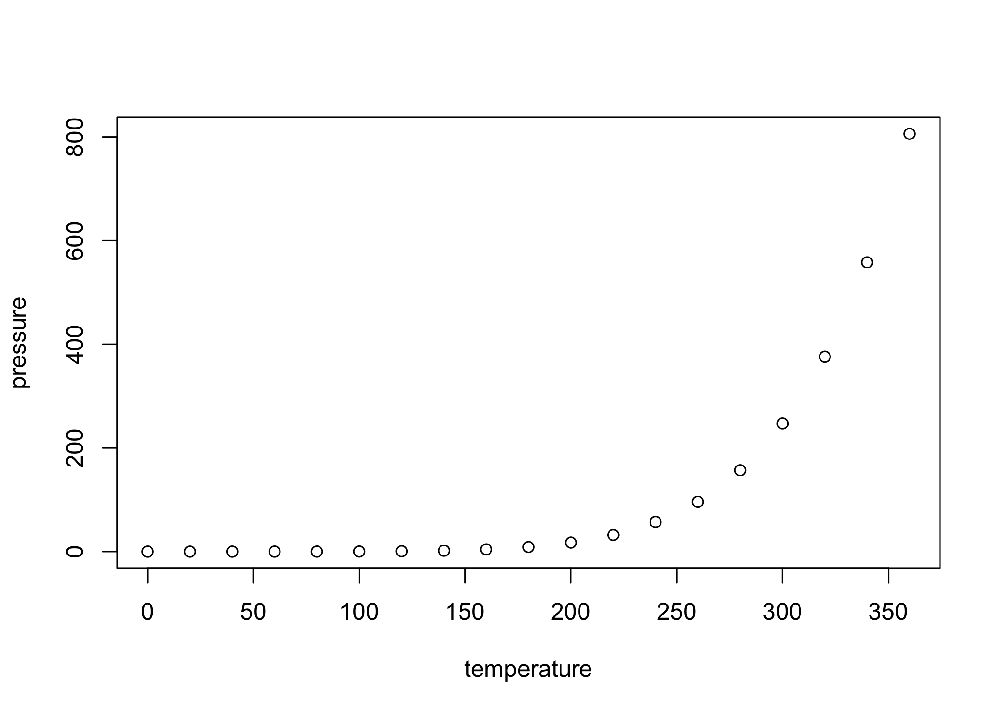

Clean Entries
================
Jane Hung
12 Nov 2020

``` r
library(data.table) 
library(gsynth)
library(ggplot2)
library(magrittr)
library(sets)

theme_set(theme_minimal())
knitr::opts_chunk$set(dpi = 300)
```

## Import MTurk Data

``` r
mturk <- fread('../data/mturk_workers.csv')
```

    ## Warning in fread("../data/mturk_workers.csv"): Detected 30 column names but the
    ## data has 28 columns. Filling rows automatically. Set fill=TRUE explicitly to
    ## avoid this warning.

``` r
mturk_subset <- mturk[,c("AssignmentId","WorkerId","AssignmentStatus","AcceptTime","SubmitTime","Answer.surveycode")]
head(mturk_subset)
```

    ##                      AssignmentId       WorkerId AssignmentStatus
    ## 1: 3018Q3ZVOKUHIDI41OOUAK3YM4PRAX A3TDR6MXS6UO5Z        Submitted
    ## 2: 304SM51WA58Y22N9MROVV5S0QOUBS1 A141U21ZM8A3KE        Submitted
    ## 3: 308XBLVESK8M1NNW72OQ5VN44MBBRD  A2RGDYBSWA09Q        Submitted
    ## 4: 30BUDKLTXFZV331IKMDD32OTF1ZE52  AVINXZZV3FNG7        Submitted
    ## 5: 30BXRYBRP6110W746O8SE5YJREUWHG A303MN1VOKQG5I        Submitted
    ## 6: 30JNVC0ORBOWGZBIUF9MMGGX3DDQH6 A2B440I6FMERCD        Submitted
    ##                      AcceptTime                   SubmitTime Answer.surveycode
    ## 1: Mon Nov 09 20:17:09 PST 2020 Mon Nov 09 20:25:43 PST 2020             66911
    ## 2: Mon Nov 09 19:46:57 PST 2020 Mon Nov 09 19:57:15 PST 2020             53406
    ## 3: Mon Nov 09 19:46:56 PST 2020 Mon Nov 09 19:53:24 PST 2020             78004
    ## 4: Mon Nov 09 19:47:09 PST 2020 Mon Nov 09 20:08:04 PST 2020             89812
    ## 5: Mon Nov 09 19:46:54 PST 2020 Mon Nov 09 20:14:56 PST 2020             94488
    ## 6: Mon Nov 09 19:46:19 PST 2020 Mon Nov 09 20:10:54 PST 2020             59727

``` r
qualtrics <- fread('../data/qualtrics_results.csv')
# colnames(qualtrics)
qualtrics_subset <-
  qualtrics[, c(
    "StartDate",
    "EndDate",
    "Status" ,
    "IPAddress" ,
    "Progress",
    "Duration (in seconds)",
    "Finished",
    "RecordedDate",
    "ResponseId",
    "Q80",
    "Random ID",
    "FL_6_DO"
  )]
# get rid of results from pilot
nrow(qualtrics)
```

    ## [1] 394

``` r
qualtrics_subset <- qualtrics_subset[63:.N,]
nrow(qualtrics_subset)
```

    ## [1] 332

``` r
setnames(qualtrics_subset,'Q80','WorkerId')
setnames(qualtrics_subset,'Random ID', 'RandomID')
qualtrics_subset[,duration_min := as.numeric(`Duration (in seconds)`)/60]
head(qualtrics_subset)
```

    ##              StartDate             EndDate     Status      IPAddress Progress
    ## 1: 2020-11-09 20:46:55 2020-11-09 20:50:39 IP Address 174.88.123.135      100
    ## 2: 2020-11-09 20:47:33 2020-11-09 20:51:24 IP Address  172.93.166.91      100
    ## 3: 2020-11-09 20:47:23 2020-11-09 20:51:35 IP Address  68.36.215.223      100
    ## 4: 2020-11-09 20:46:32 2020-11-09 20:51:43 IP Address   99.75.53.174      100
    ## 5: 2020-11-09 20:47:44 2020-11-09 20:52:08 IP Address   24.35.119.43      100
    ## 6: 2020-11-09 20:46:47 2020-11-09 20:52:39 IP Address  98.212.214.93      100
    ##    Duration (in seconds) Finished        RecordedDate        ResponseId
    ## 1:                   223     True 2020-11-09 20:50:39 R_VLuUQ4C82PP9HEd
    ## 2:                   231     True 2020-11-09 20:51:25 R_29cCZD1XK1dpmdY
    ## 3:                   251     True 2020-11-09 20:51:35 R_3lVN8EncJofnqnV
    ## 4:                   310     True 2020-11-09 20:51:43 R_50vJlfmoFTK1IeB
    ## 5:                   264     True 2020-11-09 20:52:08 R_1dFaKMSjyE3FJHg
    ## 6:                   351     True 2020-11-09 20:52:39 R_25vjj4Ik4Dkm2UN
    ##          WorkerId RandomID FL_6_DO duration_min
    ## 1:  A4D99Y82KOLC8    14409   FL_41     3.716667
    ## 2: A1AC47WJLNW4G7    58508   FL_16     3.850000
    ## 3:  A77K8W55MJEKX    96075   FL_41     4.183333
    ## 4: A17TKHT8FEVH0R    74553   FL_14     5.166667
    ## 5: A1A0WM0OJMOF7Z    35543   FL_17     4.400000
    ## 6: A2VO8C41JJIQY9    84565   FL_15     5.850000

Find people who have the same survey code and verify if they’re actually
different repsonses

``` r
table(mturk_subset[,duplicated(WorkerId)])
```

    ## 
    ## FALSE 
    ##   350

``` r
table(mturk_subset[,duplicated(Answer.surveycode)])
```

    ## 
    ## FALSE  TRUE 
    ##   348     2

``` r
mturk_subset[Answer.surveycode %in% mturk_subset[mturk_subset[,duplicated(Answer.surveycode)]][,Answer.surveycode],]
```

    ##                      AssignmentId       WorkerId AssignmentStatus
    ## 1: 3M68NM076JBGVB61BB7IUF1CQL06RN A1CIDX22PNZ73D        Submitted
    ## 2: 3OSWBBLG1G1ZDG7SUXLOP3XS8O8DXI A3CEAFFVG5PLF5        Submitted
    ## 3: 3OVHNO1VE85OIB77VF99MOD3GO6DZF A2WP71VTV1F1DV        Submitted
    ## 4: 3SPJ03342371G7XU9PT1BFZEFEZJY8 A2PK7L31SZG0F3        Submitted
    ##                      AcceptTime                   SubmitTime Answer.surveycode
    ## 1: Mon Nov 09 19:47:05 PST 2020 Mon Nov 09 20:07:09 PST 2020             83809
    ## 2: Mon Nov 09 19:47:05 PST 2020 Mon Nov 09 20:06:23 PST 2020             83809
    ## 3: Mon Nov 09 19:57:15 PST 2020 Mon Nov 09 20:19:40 PST 2020             57765
    ## 4: Mon Nov 09 19:49:00 PST 2020 Mon Nov 09 20:16:03 PST 2020             57765

``` r
qualtrics_subset[WorkerId %in% c('A1CIDX22PNZ73D','A3CEAFFVG5PLF5','A2WP71VTV1F1DV','A2PK7L31SZG0F3'),]
```

    ##              StartDate             EndDate     Status      IPAddress Progress
    ## 1: 2020-11-09 20:50:11 2020-11-09 21:04:17 IP Address 173.173.110.16      100
    ## 2: 2020-11-09 20:56:38 2020-11-09 21:06:15 IP Address 192.166.81.119      100
    ## 3: 2020-11-09 21:09:56 2020-11-09 21:16:00 IP Address 63.160.143.157      100
    ##    Duration (in seconds) Finished        RecordedDate        ResponseId
    ## 1:                   845     True 2020-11-09 21:04:18 R_2w0GpRGeYxzctPA
    ## 2:                   577     True 2020-11-09 21:06:15 R_10BDDTUUp4Tmtdl
    ## 3:                   363     True 2020-11-09 21:16:00 R_3HZTu3IA91XIlWk
    ##          WorkerId RandomID FL_6_DO duration_min
    ## 1: A1CIDX22PNZ73D    83809   FL_15    14.083333
    ## 2: A3CEAFFVG5PLF5    83809   FL_14     9.616667
    ## 3: A2PK7L31SZG0F3    57765   FL_41     6.050000

Find duplicates on the Qualtrics side.

``` r
table(qualtrics_subset[,duplicated(WorkerId)])
```

    ## 
    ## FALSE  TRUE 
    ##   329     3

``` r
qualtrics_subset[WorkerId %in% qualtrics_subset[qualtrics_subset[,duplicated(WorkerId)],WorkerId]]
```

    ##              StartDate             EndDate     Status      IPAddress Progress
    ## 1: 2020-11-09 20:47:40 2020-11-09 20:52:53 IP Address  63.75.254.226      100
    ## 2: 2020-11-09 20:50:40 2020-11-09 20:56:48 IP Address  63.75.253.115      100
    ## 3: 2020-11-09 20:52:59 2020-11-09 20:58:04 IP Address  63.75.254.226      100
    ## 4: 2020-11-09 20:47:03 2020-11-09 20:59:26 IP Address 122.174.123.52      100
    ## 5: 2020-11-09 20:59:52 2020-11-09 21:03:18 IP Address 122.174.123.52      100
    ##    Duration (in seconds) Finished        RecordedDate        ResponseId
    ## 1:                   312     True 2020-11-09 20:52:53 R_3qk9xE3wbneC3N7
    ## 2:                   367     True 2020-11-09 20:56:49 R_3HBQsMSMCgXPpKf
    ## 3:                   304     True 2020-11-09 20:58:04 R_dbzictBknL9jG3T
    ## 4:                   742     True 2020-11-09 20:59:27 R_2S8ZjieAD8WjXc6
    ## 5:                   205     True 2020-11-09 21:03:18 R_1eRkKqfVAmkVzj2
    ##          WorkerId RandomID FL_6_DO duration_min
    ## 1: A3EPIT2P3ISA3K    42254   FL_15     5.200000
    ## 2: A3EPIT2P3ISA3K    37684   FL_16     6.116667
    ## 3: A3EPIT2P3ISA3K    72442   FL_14     5.066667
    ## 4: A2XIHO2W7EEP32    31052   FL_16    12.366667
    ## 5: A2XIHO2W7EEP32    33364   FL_41     3.416667

``` r
mturk_subset[WorkerId %in% qualtrics_subset[qualtrics_subset[,duplicated(WorkerId)],WorkerId]]
```

    ##                      AssignmentId       WorkerId AssignmentStatus
    ## 1: 36NEMU28XHHNSA8FXLO56A6F80TWMP A2XIHO2W7EEP32        Submitted
    ## 2: 3TMSXRD2X84QWLMQ4Z57MIICAPZ1WN A3EPIT2P3ISA3K        Submitted
    ##                      AcceptTime                   SubmitTime Answer.surveycode
    ## 1: Mon Nov 09 19:46:56 PST 2020 Mon Nov 09 20:03:16 PST 2020             33364
    ## 2: Mon Nov 09 19:47:20 PST 2020 Mon Nov 09 19:58:13 PST 2020             72442

These guys did the survey multiple times but only submitted to Mturk
once. Let’s see if they used the same survey code
elsewhere

``` r
mturk_subset[Answer.surveycode %in% c("42254", "37684", "72442", "31052", "33364")]
```

    ##                      AssignmentId       WorkerId AssignmentStatus
    ## 1: 36NEMU28XHHNSA8FXLO56A6F80TWMP A2XIHO2W7EEP32        Submitted
    ## 2: 3TMSXRD2X84QWLMQ4Z57MIICAPZ1WN A3EPIT2P3ISA3K        Submitted
    ##                      AcceptTime                   SubmitTime Answer.surveycode
    ## 1: Mon Nov 09 19:46:56 PST 2020 Mon Nov 09 20:03:16 PST 2020             33364
    ## 2: Mon Nov 09 19:47:20 PST 2020 Mon Nov 09 19:58:13 PST 2020             72442

Do we have many people who did not take the survey and just entered in a
random survery code?

``` r
length(unique(mturk_subset$WorkerId))
```

    ## [1] 350

``` r
length(unique(qualtrics_subset$WorkerId))
```

    ## [1] 329

``` r
data <- merge(mturk_subset,qualtrics_subset,by='WorkerId',all.x = TRUE)
workers_not_complete <-data[is.na(RandomID),][order(WorkerId)][,WorkerId]
length(workers_not_complete)
```

    ## [1] 27

``` r
workers_not_complete
```

    ##  [1] "A140DTJHRHQM4F" "A18WFPSLFV4FKY" "A1G1PUPGA9IB7J" "A1GMYDH5MKN105"
    ##  [5] "A1KIAFYTOPEV2T" "A1R5501S7ARLU3" "A2B0DHIYXB7647" "A2IGIOD74EPOEF"
    ##  [9] "A2MH5LSEGJZAXF" "A2NDVK0A3U7GWY" "A2PDEHYI2M81EC" "A2UEY5LEXZ1I4O"
    ## [13] "A2WJMGV0HKQG3Z" "A2WP71VTV1F1DV" "A36XG2BJZH6ZKJ" "A397UZ7NAKTL0P"
    ## [17] "A39AAWF3F8OM6Q" "A39RDFL447IDSP" "A3GMRPF5MCQVGV" "A8H1AW1NWPMAJ" 
    ## [21] "A8NFLCEXUSFDM"  "AIEQANG943IW8"  "AJ1Q54P37KT5R"  "AQP4PHYDXRBPI" 
    ## [25] "AS11GF9V8TFC4"  "AT13O9Y4E9RUV"  "AYZX9T7RBX3ZP"

There’s one person who started the survey and completed the code in
MTurk before finishing up the
survey.

``` r
data2 <- merge(mturk_subset,qualtrics_subset,by.x=c('WorkerId','Answer.surveycode'),by.y = c('WorkerId','RandomID'),all.x = TRUE)
workers_not_complete2 <- data2[is.na(Finished),][order(WorkerId)][,WorkerId]
length(workers_not_complete2)
```

    ## [1] 28

``` r
workers_not_complete2[!workers_not_complete2 %in% workers_not_complete]
```

    ## [1] "A1VJ6JU89HP7MC"

``` r
qualtrics_subset[WorkerId == "A1VJ6JU89HP7MC"]
```

    ##              StartDate             EndDate     Status     IPAddress Progress
    ## 1: 2020-11-09 21:14:04 2020-11-10 02:05:34 IP Address 103.58.65.147      100
    ##    Duration (in seconds) Finished        RecordedDate        ResponseId
    ## 1:                 17489     True 2020-11-10 02:05:35 R_2V4Maa8CtFW5rPj
    ##          WorkerId RandomID FL_6_DO duration_min
    ## 1: A1VJ6JU89HP7MC    11201   FL_41     291.4833

``` r
mturk_subset[WorkerId == "A1VJ6JU89HP7MC"]
```

    ##                      AssignmentId       WorkerId AssignmentStatus
    ## 1: 3JW0YLFXRVKJXM2T1NUSF886627WWG A1VJ6JU89HP7MC        Submitted
    ##                      AcceptTime                   SubmitTime Answer.surveycode
    ## 1: Mon Nov 09 19:47:09 PST 2020 Mon Nov 09 20:16:05 PST 2020    A1VJ6JU89HP7MC

This Worker does not have matching survey codes, but he sent me a
message with the correct survey
code.

``` r
data3 <- merge(mturk_subset,qualtrics_subset,by.x='Answer.surveycode',by.y='RandomID',all.x = TRUE)
workers_not_complete3 <- data3[is.na(WorkerId.y)][order(WorkerId.x)][,WorkerId.x]
# workers_not_complete[!workers_not_complete %in% workers_not_complete3]
workers_not_complete3[!workers_not_complete3 %in% workers_not_complete]
```

    ## [1] "A1VJ6JU89HP7MC"

``` r
qualtrics_subset[WorkerId=="A1VJ6JU89HP7MC",]
```

    ##              StartDate             EndDate     Status     IPAddress Progress
    ## 1: 2020-11-09 21:14:04 2020-11-10 02:05:34 IP Address 103.58.65.147      100
    ##    Duration (in seconds) Finished        RecordedDate        ResponseId
    ## 1:                 17489     True 2020-11-10 02:05:35 R_2V4Maa8CtFW5rPj
    ##          WorkerId RandomID FL_6_DO duration_min
    ## 1: A1VJ6JU89HP7MC    11201   FL_41     291.4833

``` r
mturk_subset[WorkerId=="A1VJ6JU89HP7MC",]
```

    ##                      AssignmentId       WorkerId AssignmentStatus
    ## 1: 3JW0YLFXRVKJXM2T1NUSF886627WWG A1VJ6JU89HP7MC        Submitted
    ##                      AcceptTime                   SubmitTime Answer.surveycode
    ## 1: Mon Nov 09 19:47:09 PST 2020 Mon Nov 09 20:16:05 PST 2020    A1VJ6JU89HP7MC

Check to see if there are any survey codes that are more than 6
digits.

``` r
qualtrics_subset[WorkerId %in% mturk_subset[nchar(Answer.surveycode)>5,WorkerId]]
```

    ##              StartDate             EndDate     Status     IPAddress Progress
    ## 1: 2020-11-09 21:14:04 2020-11-10 02:05:34 IP Address 103.58.65.147      100
    ##    Duration (in seconds) Finished        RecordedDate        ResponseId
    ## 1:                 17489     True 2020-11-10 02:05:35 R_2V4Maa8CtFW5rPj
    ##          WorkerId RandomID FL_6_DO duration_min
    ## 1: A1VJ6JU89HP7MC    11201   FL_41     291.4833

``` r
mturk_subset[nchar(Answer.surveycode)>5,][order(WorkerId)][,WorkerId]
```

    ## [1] "A140DTJHRHQM4F" "A1VJ6JU89HP7MC" "A36XG2BJZH6ZKJ" "A397UZ7NAKTL0P"
    ## [5] "A39AAWF3F8OM6Q" "A39RDFL447IDSP" "A8NFLCEXUSFDM"

## Including Plots

You can also embed plots, for example:

<!-- -->

Note that the `echo = FALSE` parameter was added to the code chunk to
prevent printing of the R code that generated the plot.
