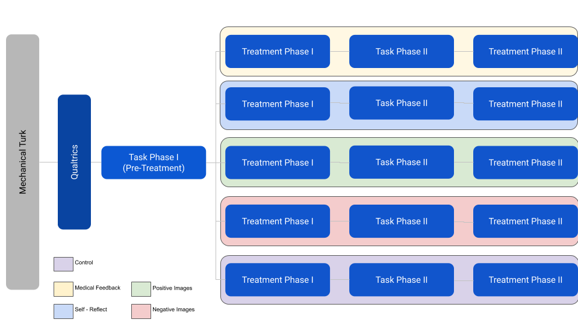
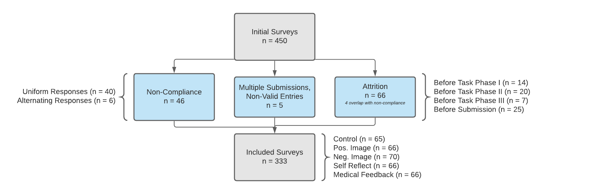

```{r, warning=FALSE, include=FALSE}
library(foreign)
library(data.table)
library(knitr)
library(cobalt)
library(stargazer)
library(sandwich)
library(car)
library(dplyr)
library(ggmap)
library(revgeo)
library(AER)
library(ggplot2)
library(expss)
library(grid)
library(gridExtra)
library(pander)
library(lmtest)
library(kableExtra)
library(bookdown)
```

```{r setup, include=FALSE}
opts_knit$set()
options(digits=3)
knitr::opts_chunk$set(echo = FALSE,warning = FALSE,message=FALSE)
rm(list = ls())
```


```{r, echo=FALSE, include=FALSE}
d_respondents <- fread('datatable_clean_survey_responses_v2.dta')
d_respondents <-
  d_respondents[!Amazon_Turk_ID %in% c(
    "A32K1M0A36EAK5",
    "A3I700VG8POSWH",
    "A3EPIT2P3ISA3K",
    "A390TP4DJI9P9W",
    "A3EPIT2P3ISA3K",
    "AUFLTHQAXWLH1",
    "AMZ1NNF182G8V",
    "A3BG20JPQLNKE1",
    "AVINXZZV3FNG7",
    "A3D4CITR1C9L3W",
    "A1BUYK6LXYWMLL",
    "A1FHRZXSE7XNJ4",
    "A12NQJV6TA5OWB",
    "AGCQCHHAQVA6R",
    "A119EX2L0DNN1B",
    "A3BPENSX5EVJ2H",
    "A371SNJNNUY9Z6",
    "A33YPBYXXZP3HY",
    "A3NYIJYBHAJ74V",
    "A2NGFU82LMJ80X",
    "A2J016DRTOBXWO",
    "A2GSZ3D2XXC533",
    "A2IGIOD74EPOEF",
    "A18WFPSLFV4FKY",
    "A1GMYDH5MKN105",
    "A8H1AW1NWPMAJ",
    "A39AAWF3F8OM6Q",
    "A26399B1QZ7XJJ",
    "A1NA92R0YGX32U",
    "A30UB0NUUWB3RM",
    "A16JX1MOPDCYDN",
    "A16X5FB3HAFCKN",
    "A211KGJ94WNFLN",
    "A1PGY59BR6C5BX",
    "AG5RF4UGQJ7A7",
    "A13T1DZG02HLNL",
    "A1WUFHQ1YGHK3C",
    "A1GNPQ5LM6YY5I",
    "A3EZ0H07TSDAPW",
    "ADLZLGHKOAEE6",
    "A1CF1W8CP0DHB0",
    "A3VP14XN3WUUOC",
    "A7VQQEIBSM9IU",
    "A8DER1QY96C5X",
    "A1M8MNKK8H5ZGW",
    "A1J3ICF1NZYFCR",
    "A34D5D6PU193AR"
  ), ]

d_attrition <- fread('attrition_only_responses_v2.dta')

```


```{r, include=FALSE}
get_robust_se <- function(model){
  # Get robust SE for use in stargazer
  vcov <- vcovHC(model,type = "HC1")
  return(sqrt(diag(vcov)))
}

create_heatmap <- function(var1, var2) {
  ### Create a heatmap for a table of frequencies between two variables
  df <- data.frame(table(var1,var2))
  
  ggplot(df,aes(x=var1,y=var2)) +
    geom_tile(aes(fill=Freq,color=Freq),show.legend=FALSE,alpha=.8) +
    geom_text(aes(label=Freq)) +
    theme(axis.text.x = element_text(angle = 90)) + 
    scale_fill_continuous(high = "darkslategray4", low = "powderblue")
}

g_legend<-function(a.gplot){
  #extract legend from a ggplot object
  #https://stackoverflow.com/questions/13649473/add-a-common-legend-for-combined-ggplots
  #https://github.com/hadley/ggplot2/wiki/Share-a-legend-between-two-ggplot2-graphs
  tmp <- ggplot_gtable(ggplot_build(a.gplot))
  leg <- which(sapply(tmp$grobs, function(x) x$name) == "guide-box")
  legend <- tmp$grobs[[leg]]
  return(legend)}
```

# Abstract
Feedback can be used as a useful tool for personal growth and success. While researchers have studied the topic for decades, few controlled studies have been conducted to fully understand the relationship between critique types, feedback loops, and their correlation with successful outcomes. The aim of this study was to assess the effectiveness of several different types of feedback in identifying positive and negative X-Ray images. 333 participants went through an online test session analyzing three sets of X-Ray lung images to determine if they contained pneumonia or if they were healthy. Participants were randomly assigned to five different feedback groups and received feedback twice in between the X-Ray image identification sessions. 

We found that expert-driven feedback was statistically significant and led to some of the highest improvements in X-Ray analysis. Furthermore, self-reflective feedback techniques were shown to be just as significant and effective. In quick, recognition-based tasks, focusing on negative feedback (i.e. what is wrong) may not be an effective strategy to improve performance. We also found that the marginal improvements in scores from a second feedback session are not significant and may not be worthwhile for shorter duration jobs. Lastly, feedback was found to be more impactful for low achieving performers. High performers do not exhibit any increased boost from feedback and may have been just as successful regardless of feedback sessions. 

# Background
Whether it is the coach and player, teacher and pupil, or manager and direct report, feedback is used pervasively in organizations with the objective of driving performance improvement for the task at hand. All leaders are encouraged to give feedback while understudies are taught to receive it openly. However, what is considered good feedback and how much of one's success on a given task can be attributed to this feedback? A large number of studies looked into the relationship between feedback and performance, summarized in a meta-analysis by Kluger & DeNisi (1996) (The effects of feedback interventions on performance: A historical review, a meta-analysis, and a preliminary feedback intervention theory. Psychological Bulletin, 119(2), 254–284). Kluger & DeNisi's review shows that while "feedback interventions" overall incrased performance, they in some cases led to decreased performance. In this study, we seek to better understand how feedback influences successful outcomes and whether different types of feedback lead to better outcomes than others. 

# Research Question
Our study highlights the broad field of research around the role of feedback on performance. Successful feedback is thought to lead to improved performance. However it is too broad of a question for an experiment to point to a causal claim. Exogenous factors such as the learning environment, the learner’s psychological mentality, or the type of task being taught may come into play in an non-experimental analysis.

Additionally, feedback can take various forms and be delivered as advice, constructive critique, or in some cases as harsh criticism. Some strategies may be better than others and others may actually negatively influence performance. As such, a well-designed experiment is necessary to find a true causal effect on learning outcomes (if any). 

The scope of our experiment is, as a result, intentionally narrow to measure the effect of different types of feedback on task performance. 

## Task selection
In our design, we ask survey respondents to recognize if an X-Ray image shows healthy lungs or lungs with pneumonia. This study introduces a novel concept to most, if not all subjects, requires strenous mental thought, and makes several extraneous elements consistent throughout the learning process (i.e. the computer-based learning environment, the feedback types, and the questions being asked are the same throughout the program). It also allows us to measure outcomes on an objective scale (number of images classified correctly) with significant data available on classified images. Our images were sourced from a labeled dataset in [Kaggle](https://www.kaggle.com/paultimothymooney/chest-xray-pneumonia).

## Hypothesis 
Our study seeks to answer the following question: 

>*What type of feedback (detailed feedback, self-reflective, etc.) leads to the largest improvements in individual performance within a simple, recognition-based task, if any?*

We are testing the null hypothesis that the varying types of feedback do not lead to better outcomes. To generalize, we then test if the average treatment effect between those who receive any feedback and those who receive a placebo will equal 0. 

A related follow-up question addresses: 

>*Does more frequent feedback yield higher task performance?*

We anticipate that more feedback touchpoints will associate with better individual performance because the receiver has more insight into how to improve and is able to calibrate to meet and surpass previous performance thresholds. However, it is unclear if the marginal gains from the second feedback loop will be as meaningful as the first. 

# Experimental Design
## Overview
This design follows a difference-in-differences design and is implemented through regression adjustment. Participants completed a three-part survey in one sitting. The random assignment occurs after the first round of questions, which allows us to pre-screen for compliance. The core analysis compares the difference in scores between the first iteration (pre-treatment) and the second iteration (after the first round of treatment) in order to test the immediate effects of feedback on performance. We further compare the first iteration scores with those in the third iteration (after the second round of treatment) to understand the effect of repeated feedback.

In this experiment, participants will view a set of X-Ray slides. Each slide contains an X-Ray image of a patient’s lungs. The participant will have to determine if the patient’s lungs are healthy or have pneumonia. Responses and timings will be recorded. Three rounds will create an answer set of 30 images (3 Rounds x 10  X-Ray images in each round). Participants will be randomly assigned to the following control or treatment groups, with two one-minute breaks in between sessions. Each intervention type, while limited in scope to the X-Ray recognition task, is meant to replicate a real-life style of feedback. The interventions are as follows:

+ *Control* - Subject watches a pharmaceutical video and is asked how the video makes them feel. This replicates the experience of someone that does not receive any internal or external feedback.
+ *Self Reflective Treatment* - Subject is shown the last round’s images, their answers, and the correct answers. They are then asked to reflect in two sentences about how they can improve. This reflects someone who does not receive feedback from others but thinks critically about their own performance and how to improve.
+ *Positive Images Treatment* - Subject is shown the images of the last round’s healthy lungs only and is asked to study those images for 1 minute. This reflects a situation where a manager provides one dimension of feedback to drive pattern recognition - in this case only images that should have passed the test. 
+ *Negative Images Treatment* - Subject is shown the images of the last round’s pneumonia-filled lungs only and is asked to study those images for 1 minute. This reflects a situation where a manager provides one dimension of feedback to drive pattern recognition - in this case only images that should not have passed the test.
+ *Specific Feedback Treatment* - Subject is shown the last round’s images, their answers, and the correct answers. They are then given easy-to-digest information from a medical textbook on how to spot pneumonia. This reflects a situation where someone is given expert-driven advice on how to accomplish a task. 


## Project Timeline
The project was conducted on the following timeline: 

| _Experiment Ideation & Design_  | _Trial Survey_ | _Survey Period_ | _Data Collection & Analysis_ | _Final Presentation_  | _Final Report_ | 
| ------------- | ------------- | ------------- | ------------- | ------------- | ------------- |
| Oct. 28 - Nov. 5, 2020  | Nov. 6 - 8,2020  | Nov. 9 - 14, 2020  | Nov. 15 - 30, 2020  | Dec. 8, 2020  | Dec. 15, 2020  |

## Enrollment and Recruitment Process
Subjects were recruited through Mechanical Turk (MTurk) and received USD 1 upon successful completion. Multiple entries from the same respondent were not permitted. Mechanical Turk lists the survey in a pool of others and payouts were given by the research team after successful completion of the survey. We ended up receiving 333 survey submissions for our main analysis. Since we charged a relatively high price point per survey, we were able to receive all of these responses in a matter of 72 hours. This may have worked in our favor by mitigating time-series related effects in the resulting data, **however it also included several drawbacks mentioned later in the paper.** 

Subjects were mostly from the United States (`r d_respondents[, sum(US_Dummy)]`) and India (`r d_respondents[country == "India", length(country)]`). There were more males that participated in the study (`r d_respondents[Gender == "Male", length(Gender)]`) than females (`r d_respondents[Gender == "Female", length(Gender)]`). 

## Communication and Measurement Tooling
The recruited Mechanical Turk participants were then given a link to the survey on Qualtrics. They were asked to enter their MTurk Worker ID and complete demographic questions before starting the survey. Friends and family were used to test the experiment flow, however none were known to have taken the full experiment, nor were part of our final analysis. 
The survey was compatible with both mobile and desktop applications. This helped reduce the barrier to entry for the survey. To help prevent non-compliance, we mandated timings on the treatment phases so that each subject fully received treatment. 


## Randomization
Since subjects were recruited from Mechanical Turk, the experiment had access to a global pool of candidates. Then, participants were randomly assigned to each of the 5 groups based on randomization logic pre-built on the Qualtrics system. Randomization occurred through the Qualtrics system after the first pre-treatment phase and split the remaining responses evenly between the four treatment groups and the control group. This randomization process is important so that treatment assignments are independent of subjects' potential outcomes. Furthermore, unaccounted-for covariates of the subject pool would not bias our estimate of the ATE. 

The Qualtrics flow can be seen below.



## Excludability and Non-Interference
This design also meets the excludability and non-interference assumptions needed to provide an unbiased estimate of the average treatment effect. Once a subject is assigned a treatment group, he or she receives a specific treatment for two separate times since treatment phases alternate with task phases 2 and 3. We meet the excludability assumption since outcomes are measured consistently through all task phases and for all assignment groups. Every task phase is scored on a scale from 1 to 10. Thus, what one subject scored in pre-treatment can be directly compared to what he or she scored in post-treatment. Furthermore, subjects are asked to essentially make diagnoses from looking at X-Ray images. We believe that this is an esoteric topic, which would make it difficult for respondents to perform third-party research while completing the survey. However, we are better able to answer this subject by reviewing the completion times below.

```{r, echo=FALSE}
#n survey responses > 30 mins., take outlier out for analysis but discuss below
outlier <- round(d_respondents[`Duration (in seconds)` > 60*30, `Duration (in seconds)`/60/60],1)
completions <- d_respondents[`Duration (in seconds)` < 60*30]

#95% of participants finished below this point in mins. 
upper_cl <- completions[, round(mean((`Duration (in seconds)`)/60) + (2 *(sd(`Duration (in seconds)`)/60)), 1)]

#density plot of time completed by assignment group in mins.
ggplot(completions, aes(x=`Duration (in seconds)`/60, fill = as.factor(Assignment_Group), colour=as.factor(Assignment_Group))) +
  geom_density(alpha = 0.35) + 
  xlim(0,60) +
  ggtitle("Survey Duration by Assignment Group (sans Outlier)") + 
  labs(x = "Minutes",color="Assignment Group") + 
  guides(fill=FALSE)+
  geom_vline(xintercept = upper_cl, linetype="dotted", color = "blue", size = 0.5) +
  theme(plot.title = element_text(hjust = 0.5)) 

```

We had one entry that took `r outlier` hours to complete the survey. This could be due to research but is likely due to other factors such as just leaving the computer idle up for certain period of time. Eliminating this outlier, 95% of participants completed the survey in `r upper_cl` minutes or less (`r upper_cl/3` minutes or less per task phase), which is illustrated by the dotted vertical line in the figure above. As such, subject driven, third-party research did not likely play a role in outcomes. The non-interference assumption is also met in this experiment since subjects are not aware of the treatments in other groups. They also do not know each other and cannot share about their treatment status with untreated subjects or vice versa. 

## Covariate Balance Checks

We examined how well our randomization worked by checking that the proportion of individuals assigned to each group was similar. Furthermore, we performed visual covariate balance checks on the survey data as it relates to gender, age range, education, and country. We additionally performed Chi Squared Tests for Independence to test for independence within each of these categories. None of the Chi-Squared tests were significant at the p = .05 level, signaling that there is no relationship between these covariates and the treatment and control assignment groups. Proportions of each covariate were consistent across assignment groups.

```{r,results='asis',echo=FALSE}
# check balance between assignment groups
pander(d_respondents[, .N, by = .(Assignment_Group)])
chisq.test(d_respondents[ , table(Assignment_Group)])

# check balance between Task 1 Score
pander(t.test(d_respondents[Treatment_Dummy == 0, TaskPhase1_Score], d_respondents[Treatment_Dummy == 1, TaskPhase1_Score]))

# check balance between Task 1 Score, expanded
pander(anova(d_respondents[,aov(TaskPhase1_Score~Assignment_Group)]))

# check balance between genders
gender_chisq <- chisq.test(d_respondents[ , table(Assignment_Group, Gender)])
  
create_heatmap(var1 = d_respondents$Assignment_Group,var2 = d_respondents$Gender) +
  xlab('Assignment Group') +
  ylab('Gender') +
  labs(title = 'Contingency table between gender and assignment group',
       caption = paste0('Assuming gender distributions are the same among assignment groups, a chi-squared test for independence with ',
                        round(gender_chisq$parameter,4),' \ndegrees of freedom ', 'yields p=',
                        round(gender_chisq$p.value,4),
                        ', suggesting that there is no relationship between gender and assignment groups at a \nsignificance level of 0.05.')) + 
  theme(plot.caption = element_text(hjust = 0),plot.title = element_text(hjust = 0.5))

# check balance between age ranges
age_chisq <- chisq.test(d_respondents[ , table(Assignment_Group, Age_Range)],simulate.p.value = TRUE)

create_heatmap(var1 = d_respondents$Assignment_Group,var2 = d_respondents$Age_Range) +
  xlab('Assignment Group') +
  ylab('Age Range') +
  labs(title = 'Contingency table between age range and assignment group',
       caption = paste0('Assuming age distributions are the same among assignment groups, a chi-squared test for independence with Monte \nCarlo simulation yields p=',
                        round(age_chisq$p.value,4),
                        ', suggesting that there is no relationship between age and assignment groups at a \nsignificance level of 0.05.')) + 
  theme(plot.caption = element_text(hjust = 0),plot.title = element_text(hjust = 0.5))

#check balance between education levels
edu_chisq <- chisq.test(d_respondents[ , table(Assignment_Group, Education_Level)],simulate.p.value = TRUE)

create_heatmap(var1 = d_respondents$Assignment_Group,var2 = d_respondents$Education_Level) +
  xlab('Assignment Group') +
  ylab('Education Level') + 
  labs(title = 'Contingency table between \neducation and assignment group',
       caption = paste0('Assuming education distributions are the same among assignment groups, a chi-squared test for \nindependence with Monte Carlo simulation yields p=',
                        round(edu_chisq$p.value,4),
                        ', suggesting that there is no relationship \nbetween education and assignment groups at a significance level of 0.05.')) + 
  theme(plot.caption = element_text(hjust = 0),plot.title = element_text(hjust = 0.5))

# check balance between US and non-US respondents
us_chisq <- chisq.test(d_respondents[ , table(Assignment_Group, US_Dummy)])

create_heatmap(var1 = d_respondents$Assignment_Group,var2 = d_respondents$US_Dummy) +
  xlab('Assignment Group') +
  ylab('Country') +
  scale_y_discrete(breaks=c("0", "1"),
                      labels=c("Non-US", "United States")) +
  labs(title = 'Contingency table between country and assignment group',
       caption = paste0('Assuming country distributions are the same among assignment groups, a chi-squared test for independence with \n',
                        round(us_chisq$parameter,4),' degrees of freedom ', 'yields p=',
                        round(us_chisq$p.value,4),
                        ', suggesting that there is no relationship between country and assignment \ngroups at a significance level of 0.05.')) + 
  theme(plot.caption = element_text(hjust = 0),plot.title = element_text(hjust = 0.5))
```

## Observation and Outcome Measurables
The data we collected was exported directly from Qualtrics into a CSV file. Data was then cleaned in R and exploratory data analysis was performed to better understand our data points. In all, we collected the following categorical data:

+ Metadata - Entry data such as start and end dates, IP Addresses, Locations, Duration, Survey Status (Finished, Incomplete)
+ Demographic Data - Age Range, Education Level, Gender
+ Assignment Group - Control, Positive Images, Negative Images, Self-Reflection, and Specific Medical Feedback
+ Responses - Survey responses for Task Phase 1 (questions 1 - 10), Task Phase 2 (questions 11 - 20), and Task Phase 3 (questions 21 - 30)
+ Scores - Scores for Task Phase 1, Task Phase 2, Task Phase 3 (each out of 10); treatment scores combining Task Phases 2 and 3 (out of 10); cumulative scores (out of 30)

Scoring is based on the number of questions a person answers correctly out of 10 questions per phase, which is then converted to a ratio value for ease of interpretation. In this case, a 10 percentage point increase in performance would signify getting 1 additional question right.

We will assess two main regressions with the following outcome variables: Task Phase 2 Scores and Task Phase 3 Scores. In the former regression, we assess whether feedback immediately affects performance; in the latter analysis, we assess whether there is a marginal increase in performance from repeated feedback.
  
Within this problem space, we will focus on two major comparisons.

1. Control vs. All Treatment Groups: This compares people who receive the control with people who receive any form of feedback treatment.
2. Individual Treatment Effects: This second comparison focuses on comparing each individual treatment group with the control and with each other.

## Data Completeness 
The experiment started off with 450 surveys sourced through MTurk. Out of this participant pool, we threw out 97 results. These results were thrown out for the following reasons: 

1. Clear non-compliance (n = 46): Some participants did not give honest effort on the survey and answered all "Normal", all "Pneumonia", or all alternating responses during Task Phase 1. This phase served as both a method to garner pre-treatment scores as well as screen for non-compliers. As such, results that aligned with this definition were treated as instances of non-compliance and thrown out of the survey; this methodology would not bias our estimates because we conducted a placebo design to assess the number of Never Takers that occur in our control/placebo group.
2. Multiple submissions and non-valid entries (n = 5):  The research team’s $1.00 per survey price point was relatively high. As a result, some participants tried to send in multiple survey responses to collect multiple payments or submit an invalid MTurk code (1 instance). In these instances we only paid for (and used) the first survey.
3. Incomplete surveys (n = 66): Some people started surveys but never finished. This includes those who never completed the last step of the survey by closing out their answers. These responses were thrown out and dealt with as instances of attrition. 

Attrition occurred at several steps in the survey. 14 dropped off before Task Phase 1 while collecting demographic information and while entering the MTurk code (did not receive treatment assignment). 20 dropped the survey during the 10 image set in Task Phase 1 or during the first treatment phase. 7 dropped off during Task Phase 2 or during the second treatment phase. 4 dropped out during Task Phase 3 and 21 of these participants had made 99% progress but had failed to close the survey. However, we treated all 66 of the aforementioned incomplete survey responses as part of attrition and were not part of our final analysis.  A funnel diagram below shows the participant drop offs of each type and at each level of the experiment:


Our exploratory data analysis digged deeper into the attrition category to see if certain control or feedback groups fell off more than others. Since assignment occurred after Task Phase 1, our survey design did not allow for us to track subject's attrition by grouping before TaskPhase 1. Qualtrics automatically assigned all attrition pre-Task Phase 1  to the negative images group. Each instance of attrition before TaskPhase 1 was falsely masked in the Negative Images category, skewing any post-assignment analysis. As such we were unable to breakout attrition by treatment group before assignment. 

```{r,echo=FALSE,results='asis'}
#table of when subjects left the experiment
attrition_table <- as.data.frame.matrix(d_attrition[, addmargins(table(Assignment_Group, Attrition_Stage))])
attrition_table <- attrition_table[c(3, 4, 1)]

kable(attrition_table, caption = "Attrition by Stage and Feedback Type") %>%
  footnote(general = "Random assignment occurs before Task Phase 2 \n 14 people attrited out of the study before Task Phase 1, and were not assigned to a treatment group")  %>%
  kable_styling(bootstrap_options = c("striped", "hover", "condensed")) %>%
  row_spec(dim(attrition_table)[1], bold = T) %>% # format last row
  column_spec(1, italic = T) #%>% # format first column  
  #column_spec(5, bold = T)# format last row

```


```{r, include=FALSE}

#By treatment group 

#Control  proportion test
# prop.test(attrition_table[1,], attrition_table[6,])
pander(fisher.test(cbind(t(attrition_table[1,]),t(attrition_table[6,]))))

#Medical Feedback proportion test
# prop.test(attrition_table[2,], attrition_table[6,])
pander(fisher.test(cbind(t(attrition_table[2,]),t(attrition_table[6,]))))

#Negative Images proportion test
# pander(prop.test(attrition_table[3,], attrition_table[6,],))
pander(fisher.test(cbind(t(attrition_table[3,]),t(attrition_table[6,])))) 

#Positive Images proportion test
# pander(prop.test(attrition_table[4,], attrition_table[6,]))
pander(fisher.test(cbind(t(attrition_table[4,]),t(attrition_table[6,])))) 

#Self Reflect proportion test
# prop.test(attrition_table[5,], attrition_table[6,])
pander(fisher.test(cbind(t(attrition_table[5,]),t(attrition_table[6,]))))

### By task phase

#before task phase 2 prop test
# prop.test(attrition_table[,1], attrition_table[,4])
pander(fisher.test(attrition_table[,c(1,4)]))

#before task phase 3 prop test
# prop.test(attrition_table[,2], attrition_table[,4])
pander(fisher.test(attrition_table[,c(2,4)]))
 
# prop.test(attrition_table[,3], attrition_table[,4])
pander(fisher.test(attrition_table[,c(3,4)]))

```

As a next step, we compared attrition rates within treatment groups and within phases as described in Table 5. We found that attrition rates were not statistically significant within these comparisons using a Fisher test (p>>.05). Since attrition is not due to any one task phase stage or treatment group, we do not have much reason for concern going forward and can contribute this attrition to randomness rather than systematic effects from any particular treatment or the experimental design.  

# Results
Overall, we have multiple ways we could have assessed this data based on our different treatment groups. We’ll primarily focus on two major comparisons.

+ Control vs. all treatment groups: This compares people who receive the control with people who receive any form of feedback treatment.
+ Differences in individual treatment groups: The second comparison focuses on comparing each individual treatment group with the control and with each other.

## Overview

### Immediate Effects of Feedback
```{r, warning=FALSE, echo=FALSE}
# Compare score across time for any treatment vs control
# https://sphweb.bumc.bu.edu/otlt/MPH-Modules/BS/BS704_Confidence_Intervals/BS704_Confidence_Intervals_print.html

summary_task_score <- (melt(d_respondents,id.vars=c('Treatment_Dummy'),
                            measure.vars = c('TaskPhase1_Score','TaskPhase2_Score','TaskPhase3_Score'))[
  ,.('avg_score'=mean(value),'sd_score'=sd(value),'obs'=.N),keyby=.(Treatment_Dummy,variable)])[
    ,se:=1.96*sd_score/sqrt(obs)]
summary_task_score$Treatment_Dummy[summary_task_score$Treatment_Dummy == 1] <- 'Received Feedback'
summary_task_score$Treatment_Dummy[summary_task_score$Treatment_Dummy == 0] <- 'No Feedback'
summary_task_score$Treatment_Dummy <- as.factor(summary_task_score$Treatment_Dummy)

summary_task_score %>%
  ggplot( aes(x=variable, y=avg_score, group=Treatment_Dummy, color=Treatment_Dummy)) +
  geom_errorbar(aes(ymin=avg_score-1.96*sd_score/sqrt(obs), ymax=avg_score+1.96*sd_score/sqrt(obs)), 
                width=.2, 
                position=position_dodge(0.25)) +
  geom_line(position=position_dodge(0.25)) + 
  geom_point(position=position_dodge(0.25)) +
  scale_y_continuous(labels = scales::percent,limits = c(.35,.75)) +
  scale_x_discrete(breaks=c("TaskPhase1_Score", "TaskPhase2_Score","TaskPhase3_Score"),
                      labels=c("Phase 1", "Phase 2", "Phase 3")) +
  xlab('Task Phases') +
  ylab('Average Task Score (%)') +
  labs(title='Average score across task phases',color="Assignment Group") +
  theme(plot.caption = element_text(hjust = 0),plot.title = element_text(hjust = 0.5))
```

When comparing task scores for across people who received feedback and people who received the placebo (shown above), we see that in Task Phase 1, average task score percentage is fairly similar between groups ($\bar{x}_{treatment}$ = `r summary_task_score[Treatment_Dummy == 'Received Feedback' & variable == 'TaskPhase1_Score', avg_score]` (*SE*=`r summary_task_score[Treatment_Dummy == 'Received Feedback' & variable == 'TaskPhase1_Score', se]`), $\bar{x}_{control}$ = `r summary_task_score[Treatment_Dummy == 'No Feedback' & variable == 'TaskPhase1_Score', avg_score]` (*SE*=`r summary_task_score[Treatment_Dummy == 'No Feedback' & variable == 'TaskPhase1_Score', se]`)). As shown in the [Covariate Balance Checks Section][Covariate Balance Checks], specifically Table 3, there is no statistical significance between pre-treatment scores in the binary assignment group case (p=`r t.test(d_respondents[Treatment_Dummy == 0, TaskPhase1_Score], d_respondents[Treatment_Dummy == 1, TaskPhase1_Score])$p.value`).

In Task Phase 2, there is a notable difference in performance after the treatment group received feedback and the control group received the placebo, which a t-test in Table 6 deems statistically significant (p=`r t.test(d_respondents[Treatment_Dummy == 0, TaskPhase2_Score], d_respondents[Treatment_Dummy == 1, TaskPhase2_Score])$p.value`). Furthermore, there is an overall drop in performance between Phase 1 and Phase 2, which suggests that the questions asked in Phase 2 were more difficult compared to those in Phase 1.

Task Phase 3 scores recovered across both binary assignment groups (t(`r t.test(d_respondents[Treatment_Dummy == 0, TaskPhase3_Score], d_respondents[Treatment_Dummy == 1, TaskPhase3_Score])$parameter`) = `r t.test(d_respondents[Treatment_Dummy == 0, TaskPhase3_Score], d_respondents[Treatment_Dummy == 1, TaskPhase3_Score])$statistic`, p=`r t.test(d_respondents[Treatment_Dummy == 0, TaskPhase3_Score], d_respondents[Treatment_Dummy == 1, TaskPhase3_Score])$p.value`), which may indicate that more rounds of feedback within this timespan do not make a significant impact compared with the placebo (see [Effects of Repeated Feedback][Effects of Repeated Feedback] for more information).

```{r,resulst='asis',warning=FALSE, echo=FALSE}
pander(t.test(d_respondents[Treatment_Dummy == 0, TaskPhase2_Score], d_respondents[Treatment_Dummy == 1, TaskPhase2_Score]))
```


### Effects of Repeated Feedback
```{r, warning=FALSE, echo=FALSE}
# Compare score across time for all groups
# https://sphweb.bumc.bu.edu/otlt/MPH-Modules/BS/BS704_Confidence_Intervals/BS704_Confidence_Intervals_print.html

summary_task_score <- (melt(d_respondents,id.vars=c('Assignment_Group'),
                            measure.vars = c('TaskPhase1_Score','TaskPhase2_Score','TaskPhase3_Score'))[
  ,.('avg_score'=mean(value),'sd_score'=sd(value),'obs'=.N),keyby=.(Assignment_Group,variable)])[
    ,se:=1.96*sd_score/sqrt(obs)]

summary_task_score %>%
  ggplot( aes(x=variable, y=avg_score, group=Assignment_Group, color=Assignment_Group)) +
  geom_errorbar(aes(ymin=avg_score-1.96*sd_score/sqrt(obs), ymax=avg_score+1.96*sd_score/sqrt(obs)), 
                width=.2, 
                position=position_dodge(0.25)) +
  geom_line(position=position_dodge(0.25)) + 
  geom_point(position=position_dodge(0.25)) +
  scale_y_continuous(labels = scales::percent,limits = c(.35,.75)) +
  scale_x_discrete(breaks=c("TaskPhase1_Score", "TaskPhase2_Score","TaskPhase3_Score"),
                      labels=c("Phase 1", "Phase 2", "Phase 3")) +
  xlab('Task Phases') +
  ylab('Average Task Score (%)') +
  labs(title='Average score across task phases', color = "Assignment Group") +
  theme(plot.caption = element_text(hjust = 0),plot.title = element_text(hjust = 0.5))
```

Repeating the former analysis on the individual treatment group parses out any substantive differences in average score across phases. Reviewing the average score within Task Phase 1 for individual treatment groups suggests there is no difference between various types of feedback 
(p=`r anova(d_respondents[,aov(TaskPhase1_Score~Assignment_Group)])[1,'Pr(>F)']`).

Most notably, respondents in the Medical Feedback Group typically score higher than the rest of the survey pool, whereas respondents in the Negative Images Group typically score lower than people in other feedback groups. However, as shown in the figure above, there is much overlap in 95% confidence intervals within each task phase, suggesting that any difference is not statistically significant at the 5% significance level.  

## Regressions

### Immediate Effects of Feedback
```{r ,results='asis',message=FALSE,echo=FALSE,warning=FALSE}
# does any treatment have an effect on task phase 2 score?
mod_task2_a <- d_respondents[, lm(TaskPhase2_Score ~ Treatment_Dummy)]

mod_task2_b <- d_respondents[, lm(TaskPhase2_Score ~ Treatment_Dummy + 
                                                     TaskPhase1_Score +
                                                     as.factor(Gender) + 
                                                     as.factor(Education_Level) + 
                                                     as.factor(Age_Range) +
                                                     as.factor(US_Dummy))]

#does the specific treatment group have an effect on task phase 2 score?
# mod_task2_c <- d_respondents[, lm(TaskPhase2_Score ~ as.factor(Assignment_Group))]

mod_task2_d <- d_respondents[, lm(TaskPhase2_Score ~ as.factor(Assignment_Group) + 
                                                     TaskPhase1_Score + 
                                                     as.factor(Gender) + 
                                                     as.factor(Education_Level) + 
                                                     as.factor(Age_Range) +
                                                     as.factor(US_Dummy))]

# does the treatment affect high performers differently
mod_task2_e <- d_respondents[, High_Performer := ifelse(TaskPhase1_Score>=.8,1,0)][,lm(TaskPhase2_Score ~ Treatment_Dummy +
                                                     # TaskPhase1_Score +
                                                     # as.factor(Gender) +
                                                     # as.factor(Education_Level) +
                                                     # as.factor(Age_Range) +
                                                     # as.factor(US_Dummy) +
                                                     Treatment_Dummy * as.factor(High_Performer))]

#stargazer output
stargazer(mod_task2_a,
          mod_task2_b,
          mod_task2_e,
          # mod_task2_c,
          mod_task2_d,
          se = list(get_robust_se(mod_task2_a),
                    get_robust_se(mod_task2_b),
                    get_robust_se(mod_task2_e),
                    # get_robust_se(mod_task2_c),
                    get_robust_se(mod_task2_d)),
          omit = c("Education_Level","Age_Range"),
          add.lines = list(c('Education FE', 'No','Yes','No','Yes'),
                           c('Age FE'      , 'No','Yes','No','Yes')),
          order = c(1,2,3,4,5),
          covariate.labels = c('Any Feedback','Medical Feedback','Negative Images','Positive Images','Self-Reflect','Task Phase 1 Score','Male','US', 'High Performer','Any Feedback:High Performer'),
          omit.stat=c("ser","f"),
          dep.var.labels = 'Task Phase 2 Score',
          no.space=TRUE,
          header=FALSE,
          title = 'Test for immediate effects of feedback on performance',
          label = 'model2',
          type='latex')
```

In order to assess the immediate effects of receiving feedback, we consider the outcome measure, `Task Phase 2 Score`, which is a post-treatment variable that measures the effect of one round of feedback/placebo (Table \@ref(model2)).

In columns 1 and 2 of Table \@ref(model2), we assess the combined effect of all feedback treatment groups by creating a treatment dummy variable `Any Feedback`. We therefore simulate the real world phenomenon where managers have diverse ways of giving feedback, but the direct reports still receive some semblance of a performance review.

```{r ,results='asis',message=FALSE,echo=FALSE,warning=FALSE,fig.cap="\\label{fig:figs}plotting example"}
pander(anova(mod_task2_a, mod_task2_b, test='F'),style='rmarkdown')
```

Column 2 of this table includes the effect of the covariates (pre-treatment score, gender, and FE from education, age, and country), which is shown to be necessary according to F-test results in Table 8. With all variables remaining constant, subjects experience a `r coeftest(mod_task2_b,vcov. = vcovHC(mod_task2_b,type='HC1'))[2,1]*100` (`r coeftest(mod_task2_b,vcov. = vcovHC(mod_task2_b,type='HC1'))[2,2]*100`) percentage point increase in task performance when any feedback is given to the survey respondents, which is statistically significant given an $\alpha=0.05$. In a notable discovery, adding in these covariates does not lead to a marginal decrease in standard error, so the ATE is no more precise when controlling for these other variables.  

To confirm pre-existing assumptions around high-performers, we find that each 10 percentage point increase in Task Phase 1 scores is associated with a `r coeftest(mod_task2_b,vcov. = vcovHC(mod_task2_b,type='HC1'))[3,1]*10` (*SE*=`r coeftest(mod_task2_b,vcov. = vcovHC(mod_task2_b,type='HC1'))[3,2]*10`) percentage point increase in performance in Task Phase 2; people who perform well before feedback may also perform well after feedback because high-performers do not require the additional feedback to be successful. This finding naturally motivated an analysis around heterogeneous treatment effects between feedback and high-performers, which found that a 10 percentage point increase in Task 1 Phase score yields an increase of `r coeftest(mod_task2_e,vcov. = vcovHC(mod_task2_e,type='HC1'))[4,1]*10` (*SE*=`r coeftest(mod_task2_e,vcov. = vcovHC(mod_task2_e,type='HC1'))[4,2]*10`) percentage points, but this is not statistically significant, suggesting that there is no incremental benefit of treatment for high performers (Column 3).  

Based on these findings, we then explored the type of feedback that would yield the most positive impact on task performance (Column 4). In doing so, we aimed to inform managers the type of feedback that would garner better performances from their direct reports. We theorized that feedback from domain expertise would foster the highest ATE because not only would subjects receive information on what they answered incorrectly, but also received expert opinion on how to properly assess the images. Abstracting this out to the real world, this would be akin to having a manager act as a mentor and using their experiences to enable individual success. At a high level, we see that when people receive specific medical feedback, they experience a `r coeftest(mod_task2_d,vcov. = vcovHC(mod_task2_d,type='HC1'))[2,1]*100` (*SE*=`r coeftest(mod_task2_d,vcov. = vcovHC(mod_task2_d,type='HC1'))[2,2]*100`) percentage point increase in performance that is statistically significant only at the $\alpha=0.1$ level, which suggests we require more research to improve the precision around this estimate.

We hypothesized that the negative images feedback would fare the worst because only results from the pneumonia images are shared. In doing so, we simulated when a manager focuses on giving feedback only in abnormal situations rather than promoting the standards to be met day-to-day. As a result, direct reports may have a poorer understanding of what “normal” or “good” looks like. **TODO INSERT STUDY FROM DAHLER** In Column 4, people in the negative image feedback group have only a `r coeftest(mod_task2_d,vcov. = vcovHC(mod_task2_d,type='HC1'))[3,1]*100` (*SE*=`r coeftest(mod_task2_d,vcov. = vcovHC(mod_task2_d,type='HC1'))[3,2]*100`) percentage point increase that is not statistically significant, indicating that negative feedback was not helpful in improving performance.

Surprisingly, people who were asked to self-reflect on their responses had a statistically significant `r coeftest(mod_task2_d,vcov. = vcovHC(mod_task2_d,type='HC1'))[5,1]*100` (*SE*=`r coeftest(mod_task2_d,vcov. = vcovHC(mod_task2_d,type='HC1'))[5,2]*100`)  percentage point increase in performance. This type of feedback is particularly interesting because self-reflection is a common personal growth technique that is touted in articles in HBR, Forbes, etc. Through this study, we were able to confirm the positive effects of self-reflection; as a manager, you might encourage this behavior through incorporating self-assessments, although in the [Conclusion][Conclusion], we discuss the caveats of applying these findings outside of the lab environment.  

```{r tab:model2_ftest,results='asis',message=FALSE,echo=FALSE,fig.cap="\\label{tab:model2_ftest} Analysis of Variance Table. All Feedback vs, Individual Feedback Effects"}
pander(anova(mod_task2_b, mod_task2_d, test='F'),style='rmarkdown')
```

Lastly, an F-test shown in Table 9 suggests that expanding on the treatment groups as shown in the table on the right does not yield a model that better represents this data (p=`r anova(mod_task2_b, mod_task2_d, test='F')[2,'Pr(>F)']`).

### Effects of Repeated Feedback
```{r,results='asis',message=FALSE,echo=FALSE}
# test final task and any treatment
mod_task3_a <- d_respondents[, lm(TaskPhase3_Score ~ Treatment_Dummy)]
mod_task3_b <- d_respondents[, lm(TaskPhase3_Score ~ Treatment_Dummy + 
                                                     TaskPhase1_Score + 
                                                     as.factor(Gender) + 
                                                     as.factor(Education_Level) + 
                                                     as.factor(Age_Range) +
                                                     as.factor(US_Dummy))]

# test final task and specific treatment
# mod_task3_c <- d_respondents[, lm(TaskPhase3_Score ~ as.factor(Assignment_Group))]
mod_task3_d <- d_respondents[, lm(TaskPhase3_Score ~ as.factor(Assignment_Group) + 
                                                     TaskPhase1_Score + 
                                                     as.factor(Gender) + 
                                                     as.factor(Education_Level) + 
                                                     as.factor(Age_Range) +
                                                     as.factor(US_Dummy))]
stargazer(mod_task3_a,
          mod_task3_b,
          # mod_task3_c,
          mod_task3_d,
          se = list(get_robust_se(mod_task3_a),
                    get_robust_se(mod_task3_b),
                    # get_robust_se(mod_task3_c),
                    get_robust_se(mod_task3_d)),
          omit = c("Education_Level","Age_Range"),
          add.lines = list(c('Education FE', 'No','Yes','Yes'),
                           c('Age FE','No','Yes','Yes')),
          order = c(1,2,3,4,5),
          covariate.labels = c('Any Feedback','Medical Feedback','Negative Images','Positive Images','Self-Reflect','Task Phase 1 Score','Male','US'),
          omit.stat=c("ser","f"),
          dep.var.labels = 'Task Phase 3 Score',
          no.space=TRUE,
          header=FALSE,
          title = 'Test for effects of repeated feedback on performance',
          label = 'model3',
          type='latex')

pander(anova(mod_task3_b, mod_task3_d, test='F'),style='rmarkdown')
```

We test the effect of multiple rounds of feedback on task performance using Task Phase 3 as an outcome variable since this task phase occurs after the subjects have received two rounds of treatment or placebo. We anticipate that more feedback received will yield even higher task performance scores compared to Task Phase 2. As a result, we would like to assess if, as a manager, he/she should instantiate more touchbases to review performance.

However, according to Table \@ref(model3), the effects of treatment are severely attenuated over time and with an additional round of feedback. For example, when assessing the effect of any feedback (Column 2), there is a meager `r coeftest(mod_task3_b,vcov. = vcovHC(mod_task3_b,type='HC1'))[2,1]*100` (*SE*=`r coeftest(mod_task3_b,vcov. = vcovHC(mod_task3_b,type='HC1'))[2,2]*100`) percentage point increase in performance, which is not statistically significant. Furthermore, expanding the analysis to illustrate individual treatment effects suggests that the varying feedback types do not garner improved performance after more rounds of feedback (Column 3). Indeed, an F-test shown in Table 11 indicates that the expanded model does not add significant value to data representation (p=`r anova(mod_task3_b, mod_task3_d, test='F')[2,'Pr(>F)']`).

The findings may be attributed to a number of underlying factors. For example, more frequent feedback during this short time span may be annoying to the receiver. The subject may have then given much less attention to the feedback because they had already received critique fairly recently. On the other hand, a respondent paying close attention to this feedback may experience increased context switching, which may detract from completing the actual task and performing well.  

### Exploratory Discussion
#### Noncompliance During Task Phases
Our main analysis is based on the assumption that the 333 respondents are all compliers, in which they all give an honest effort in answering the questions (no alternating or repeating answers) throughout all three task phases. For exploratory purposes, in this section, we consider a scenario in which we do include 46 noncompliers in our analysis. We will investigate whether there are signs of differential noncompliance.


```{r, echo=FALSE}
d <- fread('../check-valid-responses/data/qualtrics_results_final.csv')

d <-
  d[(Status == "IP Address"),] #& (Finished == 'True'),]

# These WorkerId put in all 1 response (all Normal or all Pneumonia)
# These people just gave alternating responses (Normal, Pneumonia, Normal,...,Pneumonia)
d_respondents_noncompliers <-
  d[Q80 %in% c(
    "A32K1M0A36EAK5",
    "A3I700VG8POSWH",
    "A3EPIT2P3ISA3K",
    "A390TP4DJI9P9W",
    "A3EPIT2P3ISA3K",
    "AUFLTHQAXWLH1",
    "AMZ1NNF182G8V",
    "A3BG20JPQLNKE1",
    "AVINXZZV3FNG7",
    "A3D4CITR1C9L3W",
    "A1BUYK6LXYWMLL",
    "A1FHRZXSE7XNJ4",
    "A12NQJV6TA5OWB",
    "AGCQCHHAQVA6R",
    "A119EX2L0DNN1B",
    "A3BPENSX5EVJ2H",
    "A371SNJNNUY9Z6",
    "A33YPBYXXZP3HY",
    "A3NYIJYBHAJ74V",
    "A2NGFU82LMJ80X",
    "A2J016DRTOBXWO",
    "A2GSZ3D2XXC533",
    "A2IGIOD74EPOEF",
    "A18WFPSLFV4FKY",
    "A1GMYDH5MKN105",
    "A8H1AW1NWPMAJ",
    "A39AAWF3F8OM6Q",
    "A26399B1QZ7XJJ",
    "A1NA92R0YGX32U",
    "A30UB0NUUWB3RM",
    "A16JX1MOPDCYDN",
    "A16X5FB3HAFCKN",
    "A211KGJ94WNFLN",
    "A1PGY59BR6C5BX",
    "AG5RF4UGQJ7A7",
    "A13T1DZG02HLNL",
    "A1WUFHQ1YGHK3C",
    "A1GNPQ5LM6YY5I",
    "A3EZ0H07TSDAPW",
    "ADLZLGHKOAEE6",
    "A1CF1W8CP0DHB0",
    "A3VP14XN3WUUOC",
    "A7VQQEIBSM9IU",
    "A8DER1QY96C5X",
    "A1M8MNKK8H5ZGW",
    "A1J3ICF1NZYFCR",
    "A34D5D6PU193AR"), ]

#get rid of duplicate responses
d_respondents_noncompliers <- d_respondents_noncompliers[duplicated(d_respondents_noncompliers, by = "Q80") == FALSE, ]

#rename task phase questions
setnames(d_respondents_noncompliers,
         old = c('Q2', 'Q42'),
         new = c('Self_Reflect_Q1', 'Self_Reflect_Q2'))

setnames(d_respondents_noncompliers,
         old = c('Q69', 'Q89'),
         new = c('Control_Q1', 'Control_Q2'))

setnames(d_respondents_noncompliers,
         old = c('Q80', 'Q82', 'Q83', 'Q84', 'SC0', 'FL_6_DO'),
         new = c('Amazon_Turk_ID', 'Gender', 'Age_Range', 'Education_Level', 'Total_Score', 'Assignment'))

setnames(d_respondents_noncompliers, 
         old = c('Q1', 'Q5', 'Q6', 'Q7', 'Q16', 'Q17', 'Q18', 'Q19', 'Q20', 'Q21',
                 'Q8', 'Q9', 'Q10', 'Q11', 'Q22', 'Q23', 'Q24', 'Q25', 'Q26', 'Q27',
                 'Q12', 'Q13', 'Q14', 'Q15', 'Q28', 'Q29', 'Q30', 'Q31', 'Q32', 'Q33'), 
         new = c('Q1', 'Q2', 'Q3', 'Q4', 'Q5', 'Q6', 'Q7', 'Q8', 'Q9', 'Q10',
                 'Q11', 'Q12', 'Q13', 'Q14', 'Q15', 'Q16', 'Q17', 'Q18', 'Q19', 'Q20',
                 'Q21', 'Q22', 'Q23', 'Q24', 'Q25', 'Q26', 'Q27', 'Q28', 'Q29', 'Q30'))

d_respondents_noncompliers[ , c("Q1_Score", "Q2_Score", "Q3_Score", "Q4_Score", "Q5_Score",
                        "Q6_Score", "Q7_Score", "Q8_Score", "Q9_Score", "Q10_Score",
                        "Q11_Score", "Q12_Score", "Q13_Score", "Q14_Score", "Q15_Score", 
                        "Q16_Score", "Q17_Score", "Q18_Score", "Q19_Score", "Q20_Score", 
                        "Q21_Score", "Q22_Score", "Q23_Score", "Q24_Score", "Q25_Score", "Q26_Score",
                        "Q27_Score", "Q28_Score", "Q29_Score", "Q30_Score") := 
                      list(ifelse(Q1 == "Normal", 1, 0),
                            ifelse(Q2 == "Normal", 1, 0),
                            ifelse(Q3 == "Pneumonia", 1, 0),
                            ifelse(Q4 == "Pneumonia", 1, 0),
                            ifelse(Q5 == "Normal", 1, 0),
                            ifelse(Q6 == "Pneumonia", 1, 0),
                            ifelse(Q7 == "Pneumonia", 1, 0),
                            ifelse(Q8 == "Normal", 1, 0),
                            ifelse(Q9 == "Pneumonia", 1, 0),
                            ifelse(Q10 == "Normal", 1, 0),
                            ifelse(Q11 == "Pneumonia", 1, 0),
                            ifelse(Q12 == "Normal", 1, 0),
                            ifelse(Q13 == "Pneumonia", 1, 0),
                            ifelse(Q14 == "Pneumonia", 1, 0),
                            ifelse(Q15 == "Normal", 1, 0),
                            ifelse(Q16 == "Normal", 1, 0),
                            ifelse(Q17 == "Pneumonia", 1, 0),
                            ifelse(Q18 == "Normal", 1, 0),
                            ifelse(Q19 == "Pneumonia", 1, 0),
                            ifelse(Q20 == "Normal", 1, 0),
                            ifelse(Q21 == "Normal", 1, 0),
                            ifelse(Q22 == "Normal", 1, 0),
                            ifelse(Q23 == "Pneumonia", 1, 0),
                            ifelse(Q24 == "Normal", 1, 0),
                            ifelse(Q25 == "Pneumonia", 1, 0),
                            ifelse(Q26 == "Pneumonia", 1, 0),
                            ifelse(Q27 == "Pneumonia", 1, 0),
                            ifelse(Q28 == "Pneumonia", 1, 0),
                            ifelse(Q29 == "Normal", 1, 0),
                            ifelse(Q30 == "Normal", 1, 0))]

d_respondents_noncompliers[ , Assignment_Group := ifelse(Assignment == "FL_17", "Control", 
                                          ifelse(Assignment == "FL_14", "Self-Reflect",
                                          ifelse(Assignment == "FL_15", "Medical Feedback",
                                          ifelse(Assignment == "FL_16", "Positive Images", "Negative Images"))))]

d_respondents_noncompliers[ , c("TaskPhase1_Score", "TaskPhase2_Score", "TaskPhase3_Score") :=
                      list(sum(Q1_Score, Q2_Score, Q3_Score, Q4_Score, Q5_Score, Q6_Score, 
                               Q7_Score, Q8_Score, Q9_Score, Q10_Score)/10,
                           sum(Q11_Score, Q12_Score, Q13_Score, Q14_Score, Q15_Score, Q16_Score, 
                               Q17_Score, Q18_Score, Q19_Score, Q20_Score)/10,
                           sum(Q21_Score, Q22_Score, Q23_Score, Q24_Score, Q25_Score, Q26_Score, 
                               Q27_Score, Q28_Score, Q29_Score, Q30_Score)/10),
                      by = Amazon_Turk_ID]


### setting up compliers by adding complier dummy variable (Based on d_respondents)
d_respondents_compliers <- d_respondents[, c("housenumber","street","city",
                                             "county","state","zip","country",
                                             "US_Dummy"):=NULL]
d_respondents_compliers[ , Complier_Dummy := 1]

### add complier dummy for noncompliers data table
d_respondents_noncompliers[ , Treatment_Dummy := ifelse(Assignment_Group != "Control", 1, 0)]
d_respondents_noncompliers[ , Complier_Dummy := 0]

### merge compliers and noncompliers data tables: 333 + 46 = 379
d_merge_respondents_noncompliers_compliers <- rbind(d_respondents_compliers, d_respondents_noncompliers, fill=TRUE)

##############
#### Take-Up Rates for Medical Feedback
total_MedFeedback_compliers <- nrow(d_merge_respondents_noncompliers_compliers[ Assignment_Group=="Medical Feedback" & Complier_Dummy==1, ])
total_MedFeedback_rows <- nrow(d_merge_respondents_noncompliers_compliers[ Assignment_Group == "Medical Feedback",])

ITTd_Medical_Feedback <- total_MedFeedback_compliers/total_MedFeedback_rows

#### Take-Up Rates for Self-Reflect
total_selfreflect_compliers <- nrow(d_merge_respondents_noncompliers_compliers[ Assignment_Group=="Self-Reflect" & Complier_Dummy==1, ])
total_selfreflect_rows <- nrow(d_merge_respondents_noncompliers_compliers[ Assignment_Group == "Self-Reflect",])

ITTd_Self_Reflect <- total_selfreflect_compliers/total_selfreflect_rows

#### Take-Up Rates for Positive Images
total_positiveimages_compliers <- nrow(d_merge_respondents_noncompliers_compliers[ Assignment_Group=="Positive Images" & Complier_Dummy==1, ])
total_positiveimages_rows <- nrow(d_merge_respondents_noncompliers_compliers[ Assignment_Group == "Positive Images",])

ITTd_Positive_Images <- total_positiveimages_compliers/total_positiveimages_rows

#### Take-Up Rates for Negative Images
total_negativeimages_compliers <- nrow(d_merge_respondents_noncompliers_compliers[ Assignment_Group=="Negative Images" & Complier_Dummy==1, ])
total_negativeimages_rows <- nrow(d_merge_respondents_noncompliers_compliers[ Assignment_Group == "Negative Images",])

ITTd_Negative_Images <- total_negativeimages_compliers/total_negativeimages_rows

#### Take-Up Rates for Control
total_control_compliers <- nrow(d_merge_respondents_noncompliers_compliers[ Assignment_Group=="Control" & Complier_Dummy==1, ])
total_control_rows <- nrow(d_merge_respondents_noncompliers_compliers[ Assignment_Group == "Control",])

ITTd_Control <- total_control_compliers/total_control_rows


##############
# Medical Feedback CACE
ITT_Medical_Feedback <- d_merge_respondents_noncompliers_compliers[ Assignment_Group=="Medical Feedback" , 
                                                                    mean(TaskPhase2_Score)] - 
  d_merge_respondents_noncompliers_compliers[Assignment_Group=="Control" , mean(TaskPhase2_Score)]

CACE_Medical_Feedback <- ITT_Medical_Feedback/ITTd_Medical_Feedback


# Positive Images CACE
ITT_Positive_Images <- d_merge_respondents_noncompliers_compliers[ Assignment_Group=="Positive Images" , mean(TaskPhase2_Score)] - 
  d_merge_respondents_noncompliers_compliers[Assignment_Group=="Control" , mean(TaskPhase2_Score)]

CACE_Positive_Images <- ITT_Positive_Images/ITTd_Positive_Images


# Negative Images CACE
ITT_Negative_Images <- d_merge_respondents_noncompliers_compliers[ Assignment_Group=="Negative Images" , mean(TaskPhase2_Score)] - 
  d_merge_respondents_noncompliers_compliers[Assignment_Group=="Control" , mean(TaskPhase2_Score)]

CACE_Negative_Images <- ITT_Negative_Images/ITTd_Negative_Images


# Self-Reflect CACE
ITT_Self_Reflect <- d_merge_respondents_noncompliers_compliers[ Assignment_Group=="Self-Reflect" , mean(TaskPhase2_Score)] - 
  d_merge_respondents_noncompliers_compliers[Assignment_Group=="Control" , mean(TaskPhase2_Score)]

CACE_Self_Reflect <- ITT_Self_Reflect/ITTd_Self_Reflect


# Any Treatment CACE
ITT <- d_merge_respondents_noncompliers_compliers[ Treatment_Dummy==1 , mean(TaskPhase2_Score)] - 
  d_merge_respondents_noncompliers_compliers[Treatment_Dummy==0 , mean(TaskPhase2_Score)]

ITTd <- nrow(d_merge_respondents_noncompliers_compliers[ Treatment_Dummy == 1 & Complier_Dummy == 1,])/
  nrow(d_merge_respondents_noncompliers_compliers[Treatment_Dummy == 1])

CACE_Any_Treatment <- ITT/ITTd


```

We start with examining the distribution of noncompliers across control and treatment groups. We run a 5-sample proportions test to see whether the take-up rates across treatment groups are similar. With a p-value of `r prop.test(x = c(total_MedFeedback_compliers, total_selfreflect_compliers, total_positiveimages_compliers,total_negativeimages_compliers, total_control_compliers), n = c(total_MedFeedback_rows, total_selfreflect_rows, total_positiveimages_rows, total_negativeimages_rows, total_control_rows))[3][1]`, there are no statistically significant differences between take-up rates across groups at the $\alpha=0.05$ level and no evidence of differential noncompliance.

```{r, echo=FALSE,results='asis',warning=FALSE}
pander(d_respondents_noncompliers[ , table(Assignment_Group)])
# chisq.test(d_respondents_noncompliers[ , table(Assignment_Group)]) #p = 0.8

pander(prop.test(x = c(total_MedFeedback_compliers, total_selfreflect_compliers, total_positiveimages_compliers,
                total_negativeimages_compliers, total_control_compliers), 
          n = c(total_MedFeedback_rows, total_selfreflect_rows, total_positiveimages_rows,
                total_negativeimages_rows, total_control_rows)),style='rmarkdown', split.table = Inf)


```

Now that we have calculated the take-up rates for each treatment group, we can also calculate the Intent-to-Treat effect and the Complier Average Causal Effect, which would undilute our treatment estimates for the various treatment groups from our main regressions in Table 8. We see that the CACE estimates are slightly greater than the original regression estimates, with the exception of the Negative Images group, suggesting that the Negative Images were the least effective form of feedback in improving task performance.  

```{r,echo=FALSE,results='asis'}

treatment_groups <- c("Any Treatment", "Medical Feedback", "Negative Images", "Positive Images", "Self-Reflect")
list_CACE <- round(c(CACE_Any_Treatment, CACE_Medical_Feedback, CACE_Negative_Images, CACE_Positive_Images, CACE_Self_Reflect),4)
list_ITT <- round(c(ITT, ITT_Medical_Feedback, ITT_Negative_Images, ITT_Positive_Images, ITT_Self_Reflect),4)
list_takeup <- round(c(ITTd, ITTd_Medical_Feedback, ITTd_Negative_Images, ITTd_Positive_Images, ITTd_Self_Reflect),4)
CACE_list <- cbind(treatment_groups, list_CACE, list_ITT, list_takeup)
pander(CACE_list)

```
```{r, include=FALSE, echo=FALSE}
### two stage least squares
# test <- d_merge_respondents_noncompliers_compliers[Assignment_Group %in% c("Medical Feedback", "Control"),
#                                                    ivreg(TaskPhase2_Score ~ Complier_Dummy, ~Assignment_Group)]
# 
# summary(test)
# 
# 
# 
# coeftest(test, vcov. = vcovHC(test, type = "HC1"))
# 
# d_merge_respondents_noncompliers_compliers[ ,table(Complier_Dummy, Assignment_Group)]
```


#### Noncompliance During Treatment Phases
Our main analysis's definition of noncompliance was based on respondents' performances during the pre-treatment phase. In this section, we explore the idea around identifying noncompliance during treatment, which is after the fact that respondents were randomly assigned. Since we cannot observe each respondent's behavior during treatment phases, the only ways we can plausibly detect signs of noncompliance during treatment is examining the amount of time spent each user spent on his/her respective treatment pages in the survey. However, determining a hard-set rule that funnels some respondents into noncompliance would also require major assumptions. Thus, our discussion here is only exploratory and does not help us to adjust our treatment estimates. This section is for informative purposes and may help us formulate a better experimental design in the future. In the following figures, we plot the distribution of the times spent during Treatment Phase 1 and Treatment Phase 2 for the 333 respondents that were included in our main analysis.

Both Medical Feedback and Self-Reflect treatment groups shared the same time constraints. We configured the survey settings so that respondents could proceed to the next page (leave the treatment phase) after 90 seconds have elapsed. The page would automatically advance to the next page after 240 seconds have elapsed. Thus, it is interesting to note that there were respondents who remained on the page beyond the 240-second time limit. We can visually see that respondents in the Medical Feedback group spent more time in Treatment Phase 1 than respondents in the Self-Reflect group did. There was a spike of respondents who exited treatment as soon as they were eligible to at the 90-second marker. Then, the number of people leaving treatment gradually decreased between the minimum and maximum time markers (reminiscent of the shape of a power-law distribution), followed by a second surge of leavers at the maximum time marker. Excluding those who stayed beyond the time limit, when conducting a T-Test comparing the difference in mean times between the two treatment groups, we find that the difference is not statistically significant at the $\alpha=0.05$ level.

During Treatment Phase 2, we notice that respondents in both treatment groups spent less time during treatment relative to Treatment Phase 1, as there was an increase of people in the Self-Reflect group who exited treatment as soon as they were eligible to at the 90-second minimum marker. Still, those in the Medical Feedback group stayed in the treatment phase longer than those in the Self-Reflect group did. However, conducting a T-Test comparing the difference in mean times between the two groups during this treatment phase, we find that the difference is not statistically significant at the $\alpha=0.05$ level. We find similar results when comparing the mean times of staying in treatment between Task Phase 1 and Task Phase 2. While not statistically significant, practically speaking, the results do show that for both Medical Feedback and Self-Reflect groups, the mean times of staying in treatment are shorter in Task Phase 2 than in Task Phase 1, which brings up the question of whether there were more noncompliers who breezed through the second round of treatment. 

```{r, echo=FALSE}
# renaming Control Clicks Phase 1 - submit after 70, advance after 180 seconds
setnames(d_respondents,
         old = c('Q70_First Click', 'Q70_Last Click', 
                 'Q70_Page Submit', 'Q70_Click Count'),
         new = c('Control_Phase1_First_ClickTime', 'Control_Phase1_Last_ClickTime',
                 'Control_Phase1_SubmitTime', 'Control_Phase1_NumClicks'))

# renaming Control Clicks Phase 2 - submit after 70, advance after 180 seconds
setnames(d_respondents,
         old = c('Q90_First Click', 'Q90_Last Click', 
                 'Q90_Page Submit', 'Q90_Click Count'),
         new = c('Control_Phase2_First_ClickTime', 'Control_Phase2_Last_ClickTime',
                 'Control_Phase2_SubmitTime', 'Control_Phase2_NumClicks'))

# renaming Self Reflect Clicks Phase 1 - submit after 90, advance after 240 seconds
setnames(d_respondents,
         old = c('Q61_First Click', 'Q61_Last Click', 
                 'Q61_Page Submit', 'Q61_Click Count'),
         new = c('Self_Reflect_Phase1_First_ClickTime', 'Self_Reflect_Phase1_Last_ClickTime',
                 'Self_Reflect_Phase1_SubmitTime', 'Self_Reflect_Phase1_NumClicks'))

# renaming Self Reflect Clicks Phase 2 - submit after 90, advance after 240 seconds
setnames(d_respondents,
         old = c('Q62_First Click', 'Q62_Last Click', 
                 'Q62_Page Submit', 'Q62_Click Count'),
         new = c('Self_Reflect_Phase2_First_ClickTime', 'Self_Reflect_Phase2_Last_ClickTime',
                 'Self_Reflect_Phase2_SubmitTime', 'Self_Reflect_Phase2_NumClicks'))

# renaming Medical Feedback Clicks Phase 1 - submit after 90, advance after 240 seconds
setnames(d_respondents,
         old = c('Q63_First Click', 'Q63_Last Click', 
                 'Q63_Page Submit', 'Q63_Click Count'),
         new = c('Medical_Feedback_Phase1_First_ClickTime',
                 'Medical_Feedback_Phase1_Last_ClickTime',
                 'Medical_Feedback_Phase1_SubmitTime', 
                 'Medical_Feedback_Phase1_NumClicks'))

# renaming Medical Feedback Clicks Phase 2 - submit after 90, advance after 240 seconds
setnames(d_respondents,
         old = c('Q64_First Click', 'Q64_Last Click', 
                 'Q64_Page Submit', 'Q64_Click Count'),
         new = c('Medical_Feedback_Phase2_First_ClickTime', 
                 'Medical_Feedback_Phase2_Last_ClickTime',
                 'Medical_Feedback_Phase2_SubmitTime', 
                 'Medical_Feedback_Phase2_NumClicks'))

# renaming Positive Images Clicks Phase 1 - submit after 45, advance after 120 seconds
setnames(d_respondents,
         old = c('Q65_First Click', 'Q65_Last Click', 
                 'Q65_Page Submit', 'Q65_Click Count'),
         new = c('Positive_Images_Phase1_First_ClickTime', 
                 'Positive_Images_Phase1_Last_ClickTime',
                 'Positive_Images_Phase1_SubmitTime', 
                 'Positive_Images_Phase1_NumClicks'))

# renaming Positive Images Clicks Phase 2 - submit after 45, advance after 120 seconds
setnames(d_respondents,
         old = c('Q66_First Click', 'Q66_Last Click', 
                 'Q66_Page Submit', 'Q66_Click Count'),
         new = c('Positive_Images_Phase2_First_ClickTime', 
                 'Positive_Images_Phase2_Last_ClickTime',
                 'Positive_Images_Phase2_SubmitTime', 
                 'Positive_Images_Phase2_NumClicks'))

# renaming Negative Images Clicks Phase 1 - submit after 45, advance after 120 seconds
setnames(d_respondents,
         old = c('Q67_First Click', 'Q67_Last Click', 
                 'Q67_Page Submit', 'Q67_Click Count'),
         new = c('Negative_Images_Phase1_First_ClickTime', 
                 'Negative_Images_Phase1_Last_ClickTime',
                 'Negative_Images_Phase1_SubmitTime', 
                 'Negative_Images_Phase1_NumClicks'))

# renaming Negative Images Clicks Phase 2 - submit after 45, advance after 120 seconds
setnames(d_respondents,
         old = c('Q68_First Click', 'Q68_Last Click', 
                 'Q68_Page Submit', 'Q68_Click Count'),
         new = c('Negative_Images_Phase2_First_ClickTime', 
                 'Negative_Images_Phase2_Last_ClickTime',
                 'Negative_Images_Phase2_SubmitTime', 
                 'Negative_Images_Phase2_NumClicks'))


# set up datatable for Treatment Phase 1 Times

a <- d_respondents[ Assignment_Group == "Medical Feedback", Medical_Feedback_Phase1_SubmitTime]
b <- d_respondents[ Assignment_Group == "Control", (Control_Phase1_SubmitTime)]
c <- d_respondents[ Assignment_Group == "Positive Images", (Positive_Images_Phase1_SubmitTime)]
d <- d_respondents[ Assignment_Group == "Negative Images", (Negative_Images_Phase1_SubmitTime)]
e <- d_respondents[ Assignment_Group == "Self-Reflect", (Self_Reflect_Phase1_SubmitTime)]

#(coalesce(c(a,b,c,d,e)))

d_noncompliance_1 <- data.table(id=1:333)
d_noncompliance_1[ , Assignment_Group := (c(rep("Medical Feedback", 66), rep("Control", 65), rep("Positive Images", 66), rep("Negative Images", 70), rep("Self-Reflect", 66)))]

d_noncompliance_1[ , Treatment_Phase1_SubmitTime := (coalesce(c(a,b,c,d,e)))]

#set up datatable for Treatment Phase 2 Times

a <- d_respondents[ Assignment_Group == "Medical Feedback", Medical_Feedback_Phase2_SubmitTime]
b <- d_respondents[ Assignment_Group == "Control", (Control_Phase2_SubmitTime)]
c <- d_respondents[ Assignment_Group == "Positive Images", (Positive_Images_Phase2_SubmitTime)]
d <- d_respondents[ Assignment_Group == "Negative Images", (Negative_Images_Phase2_SubmitTime)]
e <- d_respondents[ Assignment_Group == "Self-Reflect", (Self_Reflect_Phase2_SubmitTime)]

#(coalesce(c(a,b,c,d,e)))

d_noncompliance_2 <- data.table(id=1:333)
d_noncompliance_2[ , Assignment_Group := (c(rep("Medical Feedback", 66), rep("Control", 65), rep("Positive Images", 66), rep("Negative Images", 70), rep("Self-Reflect", 66)))]
d_noncompliance_2[ , Treatment_Phase2_SubmitTime := (coalesce(c(a,b,c,d,e)))]

```


```{r,echo=FALSE,results='asis'}
########## plot density distributions of timing for Treatment Phase 1: Medical Feedback vs Self-Reflect

ggplot(d_noncompliance_1[Assignment_Group %in% c("Medical Feedback", "Self-Reflect")], aes(x=Treatment_Phase1_SubmitTime, colour=as.factor(Assignment_Group), fill = as.factor(Assignment_Group))) + geom_histogram(alpha=0.3, position = "identity") + xlim(60, 500) + xlab("Completion Time (seconds)") + ggtitle("Treatment Phase 1 Duration Distribution") + geom_vline(xintercept = 90, color = "dodgerblue4") + geom_vline(xintercept = 240, color = "midnightblue") + theme(plot.title = element_text(hjust = 0.5)) + 
  annotate("text", x = 80, y = 5, label = "Eligible to Submit", angle=90, color="dodgerblue4") +
  annotate("text", x = 230, y = 5, label = "Auto-Advance", angle=90, color = "midnightblue") +
  labs(fill="Assignment Group") + 
  guides(color=FALSE)

ggplot(d_noncompliance_2[Assignment_Group %in% c("Medical Feedback", "Self-Reflect")], aes(x=Treatment_Phase2_SubmitTime, colour=as.factor(Assignment_Group), fill = as.factor(Assignment_Group))) + geom_histogram(alpha=0.3, position = "identity") + xlim(60, 500) + xlab("Completion Time (seconds)") + ggtitle("Treatment Phase 2 Duration Distribution") + geom_vline(xintercept = 90, color = "dodgerblue4") + geom_vline(xintercept = 240, color = "midnightblue") + theme(plot.title = element_text(hjust = 0.5)) + 
  annotate("text", x = 80, y = 5, label = "Eligible to Submit", angle=90, color="dodgerblue4") +
  annotate("text", x = 230, y = 5, label = "Auto-Advance", angle=90, color = "midnightblue") +
  labs(fill="Assignment Group") + 
  guides(color=FALSE)
```


```{r,echo=FALSE,results='asis'}
pander(t.test(d_noncompliance_1[Assignment_Group %in% c("Medical Feedback") & Treatment_Phase1_SubmitTime <= 240,
                         Treatment_Phase1_SubmitTime], 
       d_noncompliance_1[Assignment_Group %in% c("Self-Reflect") & Treatment_Phase1_SubmitTime <= 240, 
                         Treatment_Phase1_SubmitTime]),
       style='rmarkdown', split.table = Inf)

pander(t.test(d_noncompliance_2[Assignment_Group %in% c("Medical Feedback") & Treatment_Phase2_SubmitTime <= 240,
                         Treatment_Phase2_SubmitTime], 
       d_noncompliance_2[Assignment_Group %in% c("Self-Reflect") & Treatment_Phase2_SubmitTime <= 240, 
                         Treatment_Phase2_SubmitTime]),
       style='rmarkdown', split.table = Inf)
       

#statistically significant difference in time spent in treatment 1 and 2 for medical feedback
pander(t.test(d_noncompliance_1[Assignment_Group %in% c("Medical Feedback") & Treatment_Phase1_SubmitTime <= 240,
                         Treatment_Phase1_SubmitTime], 
       d_noncompliance_2[Assignment_Group %in% c("Medical Feedback") & Treatment_Phase2_SubmitTime <= 240,
                         Treatment_Phase2_SubmitTime]),
       style='rmarkdown', split.table = Inf)

#statistically significant difference in time spent in treatment 1 and 2 for self-reflect
pander(t.test(d_noncompliance_1[Assignment_Group %in% c("Self-Reflect") & Treatment_Phase1_SubmitTime <= 240,
                         Treatment_Phase1_SubmitTime], 
       d_noncompliance_2[Assignment_Group %in% c("Self-Reflect") & Treatment_Phase2_SubmitTime <= 240,
                         Treatment_Phase2_SubmitTime]),
       style='rmarkdown', split.table = Inf)
```

Both Positive Images and Negative Images treatment groups shared the same time constraints to each other. We configured the survey settings so that respondents could proceed to the next page (leave the treatment phase) after 45 seconds have elapsed. The page would automatically advance to the next page after 120 seconds have elapsed. We noticed that there was one respondent who remained on the page beyond the 120-second time limit during Treatment Phase 1. Furthermore, we can visually see that respondents in the Negative Images group spent more time in Treatment Phase 1 than respondents in the Positive Images group did. Excluding those who stayed beyond the time limit, we can confirm this with a T-Test, where the difference is statistically significant at a p-value of `r t.test(d_noncompliance_1[Assignment_Group %in% c("Positive Images"), Treatment_Phase1_SubmitTime], d_noncompliance_1[Assignment_Group %in% c("Negative Images") & Treatment_Phase1_SubmitTime <= 120, Treatment_Phase1_SubmitTime])[3][1]`. 

Similar to the Medical Feedback and Self-Reflect groups, in Treatment Phase 2, we see an increase in respondents who leave treatment at the minimum time marker. However, this increase is primarily driven by respondents in the Positive Images group as those in the Negative Images treatment group tended to stay in treatment longer, but the difference in mean times between Positive Images and Negative Images groups during this phase are not statistically significant at the $\alpha=0.05$ level. 

While the differences in mean times are not statisically significant, we do see that the amount of time respondents in the Positive Images group spent in the second round of treatment was generally less than the first. However, respondents in the Negative Images group spent roughly equal amounts of time in the first and second rounds of treatment. 

```{r,echo=FALSE,results='asis'}
########## plot density distributions of timing for Treatment Phase 1: Positive vs Negative Images

ggplot(d_noncompliance_1[Assignment_Group %in% c("Positive Images", "Negative Images")], aes(x=Treatment_Phase1_SubmitTime, colour=as.factor(Assignment_Group), fill = as.factor(Assignment_Group))) + geom_histogram(alpha=0.3, position = "identity") + xlim(20, 200) + xlab("Completion Time (seconds)") + ggtitle("Treatment Phase 1 Duration Distribution") + geom_vline(xintercept = 45, color = "dodgerblue4") + geom_vline(xintercept = 120, color = "midnightblue") + theme(plot.title = element_text(hjust = 0.5)) +
  labs(fill="Assignment Group") + 
  guides(color=FALSE)+
  annotate("text", x = 41, y = 5, label = "Eligible to Submit", angle=90, color="dodgerblue4") +
  annotate("text", x = 116, y = 5, label = "Auto-Advance", angle=90, color = "midnightblue")

ggplot(d_noncompliance_2[Assignment_Group %in% c("Positive Images", "Negative Images")], aes(x=Treatment_Phase2_SubmitTime, colour=as.factor(Assignment_Group), fill = as.factor(Assignment_Group))) + geom_histogram(alpha=0.3, position = "identity") + xlim(20, 200) + xlab("Completion Time (seconds)") + ggtitle("Treatment Phase 2 Duration Distribution") + geom_vline(xintercept = 45, color = "dodgerblue4") + geom_vline(xintercept = 120, color = "midnightblue") + theme(plot.title = element_text(hjust = 0.5)) +
  labs(fill="Assignment Group") + 
  guides(color=FALSE)+
  annotate("text", x = 41, y = 5, label = "Eligible to Submit", angle=90, color="dodgerblue4") +
  annotate("text", x = 116, y = 5, label = "Auto-Advance", angle=90, color = "midnightblue")

pander(t.test(d_noncompliance_1[Assignment_Group %in% c("Positive Images"), Treatment_Phase1_SubmitTime], 
       d_noncompliance_1[Assignment_Group %in% c("Negative Images") & Treatment_Phase1_SubmitTime <= 120,
                         Treatment_Phase1_SubmitTime]),style='rmarkdown', split.table = Inf)

pander(t.test(d_noncompliance_2[Assignment_Group %in% c("Positive Images"), Treatment_Phase2_SubmitTime], 
       d_noncompliance_2[Assignment_Group %in% c("Negative Images") & Treatment_Phase2_SubmitTime <= 120,
                         Treatment_Phase2_SubmitTime]),style='rmarkdown', split.table = Inf)

#statistically significant difference in time spent in treatment 1 and 2 for positive images
pander(t.test(d_noncompliance_1[Assignment_Group %in% c("Positive Images") & Treatment_Phase1_SubmitTime <= 120,
                         Treatment_Phase1_SubmitTime], 
       d_noncompliance_2[Assignment_Group %in% c("Positive Images") & Treatment_Phase2_SubmitTime <= 120,
                         Treatment_Phase2_SubmitTime]),style='rmarkdown', split.table = Inf)

#no statistically significant difference in time spent in treatment 1 and 2 for negative images
pander(t.test(d_noncompliance_1[Assignment_Group %in% c("Negative Images") & Treatment_Phase1_SubmitTime <= 120,
                         Treatment_Phase1_SubmitTime], 
       d_noncompliance_2[Assignment_Group %in% c("Negative Images") & Treatment_Phase2_SubmitTime <= 120,
                         Treatment_Phase2_SubmitTime]),style='rmarkdown', split.table = Inf)

```

For the Control group, we configured the survey settings so that respondents could proceed to the next page (leave the treatment phase) after 70 seconds have elapsed. The page would automatically advance to the next page after 180 seconds have elapsed. We noticed that there were some respondents who remained on the page beyond the 180-second time limit. Furthermore, respondents in the Control group tended to spend more time in Treatment Phase 1, compared to those in any of the four treatment groups. Recall that in the treatment groups, we would observe a spike of respondents who left treatment at the minimum time marker, which would gradually decrease as completion times increased. This would be followed by another spike at the maximum time marker. However, in the control group, we notice a different behavior in that the distribution of respondents between the minimum and maximum time markers would be relatively uniform. 

During Treatment Phase 2, we also see that respondents spent less time in the second round of treatment relative to the first. However, this difference is not statistically significant with at the $\alpha=0.05$ level.

```{r,echo=FALSE,results='asis'}
#### set up t-tests comparing the submit times for Treatment Phase I

ggplot(d_noncompliance_1[Assignment_Group %in% c("Control")], aes(x=Treatment_Phase1_SubmitTime, colour=as.factor(Assignment_Group), fill = as.factor(Assignment_Group))) + geom_histogram(alpha=0.3, position = "identity") + xlim(20, 300) + xlab("Completion Time (seconds)") + ggtitle("Treatment Phase 1 Duration Distribution") + geom_vline(xintercept = 70, color = "dodgerblue4") + geom_vline(xintercept = 180, color = "midnightblue") + theme(plot.title = element_text(hjust = 0.5)) + 
  labs(fill="Assignment Group") + 
  guides(color=FALSE)+
  annotate("text", x = 64, y = 5, label = "Eligible to Submit", angle=90, color="dodgerblue4") +
  annotate("text", x = 174, y = 5, label = "Auto-Advance", angle=90, color = "midnightblue")

ggplot(d_noncompliance_2[Assignment_Group %in% c("Control")], aes(x=Treatment_Phase2_SubmitTime, colour=as.factor(Assignment_Group), fill = as.factor(Assignment_Group))) + geom_histogram(alpha=0.3, position = "identity") + xlim(20, 300) + xlab("Completion Time (seconds)") + ggtitle("Treatment Phase 2 Duration Distribution") + geom_vline(xintercept = 70, color = "blue") + geom_vline(xintercept = 180, color = "red") + theme(plot.title = element_text(hjust = 0.5)) + 
  labs(fill="Assignment Group") + 
  annotate("text", x = 64, y = 5, label = "Eligible to Submit", angle=90, color="dodgerblue4") +
  annotate("text", x = 174, y = 5, label = "Auto-Advance", angle=90, color = "midnightblue") +
  guides(color=FALSE)
```


```{r,echo=FALSE,results='asis'}
pander(t.test(d_noncompliance_1[Assignment_Group %in% c("Control") & Treatment_Phase1_SubmitTime <= 180, Treatment_Phase1_SubmitTime], 
       d_noncompliance_2[Assignment_Group %in% c("Control") & Treatment_Phase2_SubmitTime <= 180, Treatment_Phase2_SubmitTime]),style='rmarkdown', split.table = Inf)
```

Throughout this exploratory discussion, with the exception of respondents in the Negative Images group, we see consistent behavior in which respondents spent less time in the second round of treatment relative to the first. Further investigation will be needed to determine if this behavior is related to the attenuating treatment effects that we observed in our regressions. This also raises questions about what the treatment experience is like for respondents in the Negative Images group since they stayed in treatment relatively consistently. In regards to the other treatment groups in which the amount of time respondents are willing to spend in treatment decreases, it is plausible that this is a sign of feedback fatigue. Further research should be done on whether such behavior would trigger noncompliance for our respondents. Nevertheless, when designing our experiment, we expected that people were to be exposed to treatment in both phases at relatively equal times. This discussion illustrates that we should focus on design improvements that encourage people to take treatment consistently.

## Power

```{r,results='asis',message=FALSE,warning=FALSE,echo=FALSE}
power.t.test( delta = .05, sd = .16, sig.level = 0.05, power = 0.8)
pander(d_respondents[, .N, by = .(Assignment_Group)])
```

Power analysis shows that our groups did not have a large enough sample size required for each group. Due to the small effect size of approximately 0.05 when comparing mean Task Phase 2 scores in treatment and control groups, for such small effects to be detected with statistical power of 80%, the number of subjects required in each group would be `r round(power.t.test( delta = .05, sd = .16, sig.level = 0.05, power = 0.8)$n)`. Our group sizes for the control group, as well as the targeted medical feedback, positive, negative, and self-reflect treatment groups were `r d_respondents[, .N, by = .(Assignment_Group)][4, 2]`, `r d_respondents[, .N, by = .(Assignment_Group)][5, 2]`, `r d_respondents[, .N, by = .(Assignment_Group)][2, 2]`, `r d_respondents[, .N, by = .(Assignment_Group)][1, 2]`, and `r d_respondents[, .N, by = .(Assignment_Group)][3, 2]` respectively. This is primarily due to the fact that we charged too high of a price point per completed survey. 

# Conclusions 
Our experiment and following study shows that feedback contributes a statistically and practically significant effect in X-Ray analysis performance (ATE = `r coeftest(mod_task2_b,vcov. = vcovHC(mod_task2_b,type='HC1'))[2,1]*100`, SE +- `r coeftest(mod_task2_b,vcov. = vcovHC(mod_task2_b,type='HC1'))[2,2]*100`%). More specifically, targeted medical feedback saw the most statistically significant increases in performance (ATE = `r coeftest(mod_task2_d,vcov. = vcovHC(mod_task2_d,type='HC1'))[2,1]*100`, SE +- `r coeftest(mod_task2_d,vcov. = vcovHC(mod_task2_d,type='HC1'))[2,2]*100`), showing that expert opinion may lead to more significant outcomes in the real world. Along the same lines, self-reflection led to statistically and practically significant improvements on performance (ATE = `r coeftest(mod_task2_d,vcov. = vcovHC(mod_task2_d,type='HC1'))[5,1]*100`, SE +- `r coeftest(mod_task2_d,vcov. = vcovHC(mod_task2_d,type='HC1'))[5,2]*100`), which bolsters recent research into the power of self-reflection techniques on a variety of everyday activities. Lastly, negative feedback loops fared the worst (ATE = `r coeftest(mod_task2_d,vcov. = vcovHC(mod_task2_d,type='HC1'))[3,1]*100`, p = `r coeftest(mod_task2_d,vcov. = vcovHC(mod_task2_d,type='HC1'))[3,4]`), showing that for recognition-based tasks, negative feedback may not lead to stronger outcomes than other methods. 

Lastly, we found that more frequent feedback loops during a short, iterative task does not lead to significant marginal improvements in performance (ATE = `r coeftest(mod_task3_b,vcov. = vcovHC(mod_task3_b,type='HC1'))[2,1]*100`, p = `r coeftest(mod_task3_b,vcov. = vcovHC(mod_task3_b,type='HC1'))[2,4]`) This may have been due to our experimental design and short duration of the task, but should lead to further research on the relationship between feedback loops and marginal productivity.

This experiment faces potential limitations when making more generalized conclusions about the effects of feedback on performance in addition to lower power. For example, the experiment required analysis of a more simple, X-Ray analysis, which is not as complex of a task when compared to multi-step tasks such as writing a paper or performing quantitative analysis. Furthermore, the experiment's computer-facing setting may have impacted results. Subjects may not have spent as much time on the task as they would in a real-life scenario. They certainly did not experience the same time or social pressures or distractions usually present in most constructive feedback instances. 

Most notably, our experiment may not generalize well to the external environment because our MTurk worker population may not be a representative cohort of the real working population. In fact, our study participants may reflect more accurately the effect of feedback on people with lower income (income < \$150K) and who are younger (age < 50 years old) [(Moss & Litman, )](https://www.cloudresearch.com/resources/blog/who-uses-amazon-mturk-2020-demographics/). In actuality, the MTurk population may benefit the most from feedback because younger people typically have less work experience and may need guidance to further their performance. In addition, people with lower incomes who accept requests through MTurk also demonstrate a desire to improve their financial position, so they may benefit substantially from feedback that drives performance and, subsequently, income [(Buchheit et al, 2018)](https://libproxy.berkeley.edu/login?qurl=https%3a%2f%2fsearch.ebscohost.com%2flogin.aspx%3fdirect%3dtrue%26db%3dbth%26AN%3d128628976%26site%3deds-live).

However, the study's conclusions give us confidence that feedback positively affects performance in a meaningful way and more specifically targeted, informative feedback drives success. The effects of feedback on performance are significant and merit additional study. 

# Limitations and Future Enhancements
The research design generated an output with limited power due to several factors. First, we handicapped the total amount of participants by offering too high of a price point for the survey. Our experiment offered a \$1 price point per successful entry (limit of one entry per person), which afforded only a maxiumum possible 350 participants in our study to comply with the set $500 budget (including fees charged by MTurk). We should have, however, charged ~ \$0.25, which is on par with average MTurk prices per task and would have allowed us to recruit more participants and achieve higher power. These changes would have given the experiment an estimated 2000 participants, with 400 in the control group and in each of the treatment groups. Power for the experiment would have increased substantially and allowed for more meaningful outcomes.  

To combat noncompliance issues, we can redesign the Qualtrics survey flow so that we can stop the survey for potential noncompliers when they either give alternating answers or the same answers during Task Phase 1. This will help ensure that only complying respondents get randomized into treatment. As for dealing with potential noncompliance during the Treatment Phases, other design considerations would need to be included so that respondents are encouraged to stay within the treatment phase for longer time periods since we noticed that nearly all respondents in treatment groups spent less time in Treatment Phase 2 than in Treatment Phase 1. Other survey improvements such as enforcing word limits in specific treatment phases and tracking the time lapsed during task phases would also help us limit noncompliance (in case respondents rush through answering questions). We saw several terse responses to open-ended questions in the self-reflect and control groups, which are possible signs of noncompliance. Implementing a word minimum limit for respondents in the survey would deter this behavior. Furthermore, we noticed that there were respondents who were able to stay in treatment for longer times than originally prescribed. This could be due to a technical issue from Qualtrics that would have to undergo further qualtity-control testing. 

Another improvement that could enhance the experiment would be a factorial design that would allow us to explore heterogeneous treatment effects. Our current implementation explores the differences between four selected types of feedback that were meant to parallel feedback scenarios found in the real-world. However, our analysis would be more robust if we considered whether certain components of feedback were more effective in improving task performance. A factorial design would allow us to consider such nuances of providing feedback, and potentially help us determine if the presence of a writing component, a reading component, a visual component, an answer key, or an interaction of multiple factors would best improve task performance.


