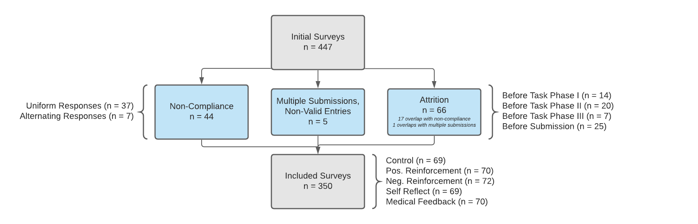

```{r, include=FALSE}
library(foreign)
library(data.table)
library(knitr)
library(cobalt)
library(stargazer)
library(sandwich)
library(car)
library(dplyr)
library(ggmap)
library(revgeo)
library(AER)
library(ggplot2)
library(expss)
library(grid)
library(gridExtra)
library(pander)
library(kableExtra)
```

```{r setup, include=FALSE}
opts_knit$set()
options(digits=4)
knitr::opts_chunk$set(echo = TRUE)
```


```{r include=FALSE}
d_respondents <- fread('datatable_clean_survey_responses_v2.dta')
d_attrition <- fread('attrition_only_responses_v2.dta')
```

```{r, include=FALSE}
get_robust_se <- function(model){
  # Get robust SE for use in stargazer
  vcov <- vcovHC(model,type = "HC1")
  return(sqrt(diag(vcov)))
}

create_heatmap <- function(var1, var2) {
  ### Create a heatmap for a table of frequencies between two variables
  df <- data.frame(table(var1,var2))
  
  ggplot(df,aes(x=var1,y=var2)) +
    geom_tile(aes(fill=Freq,color=Freq),show.legend=FALSE,alpha=.8) +
    geom_text(aes(label=Freq)) +
    theme(axis.text.x = element_text(angle = 90)) + 
    scale_fill_continuous(high = "darkslategray4", low = "powderblue")
}

g_legend<-function(a.gplot){
  #extract legend from a ggplot object
  #https://stackoverflow.com/questions/13649473/add-a-common-legend-for-combined-ggplots
  #https://github.com/hadley/ggplot2/wiki/Share-a-legend-between-two-ggplot2-graphs
  tmp <- ggplot_gtable(ggplot_build(a.gplot))
  leg <- which(sapply(tmp$grobs, function(x) x$name) == "guide-box")
  legend <- tmp$grobs[[leg]]
  return(legend)}
```

# Abstract
Feedback can be used as a useful tool for personal growth and success. While researchers have studied the topic for decades, few controlled studies have been conducted to fully understand the relationship between critique types, feedback loops, and their correlation with successful outcomes. The aim of this study was to assess the effectiveness of several different types of feedback in identifying positive and negative X-Ray images. 350 participants went through an online test session analyzing three sets of X-Ray lung images to determine if they contained pneumonia if they were healthy. Participants were randomly assigned to five different feedback groups and received feedback twice in between the X-Ray imaging sessions. 

We found that expert-driven feedback was statistically significant and led to some of the highest improvements in X-Ray analysis. Furthermore, self-reflective feedback techniques were shown to be just as significant and effective. In quick, recognition-based tasks, focusing on negative feedback (i.e. what is wrong) may not be an effective strategy to improve performance. We also found that the marginal improvements in scores from a second feedback session are not significant and may not be worthwhile for shorter duration jobs. Lastly, feedback was found to be more impactful for low achieving performers. High performers do not exhibit any increased boost from feedback and may have been just as successful regardless of feedback sessions. 

# Background
Whether its the coach and player, teacher and pupil, or managers and direct reports, feedback likely plays an important role in delivering successful outcomes. All leaders are encouraged to give feedback while understudies are taught  to receive critique openly. However, what is good feedback and how much of one's success on a given task be attributed to this feedback? Suprisingly few, well-developed experiments have been conducted to investigate this relationship.In this study, we seek to better understand if feedback truly influences successful outcomes and if different types of feedback lead to better outcomes than others. 

# Research Question
Our study highlights the broad field of research around the role of feedback on performance. Successful feedback is thought to lead to improved performance. However it is too broad of a question for an experiment to point to a causal claim.  Exogenous factors such as the learning environment, the learner’s psychological mentality, or the type of task being taught may come into play in an non-experimental analysis. 

Additionally, feedback comes in various forms, both positive and negative, internal and external. Some strategies may be better than others and others may actually negatively influence performance. As such, a well-designed experiment is necessary to find a true causal effect on learning outcomes (if any). 

The scope of our experiment is, as a result, intentionally narrow to measure the effect of different types of feedback on task performance. In our design, we ask survey respondents to recognize if an X-Ray image shows healthy lungs or lungs with pneumonia. This study introduces a novel concept to most, if not all subjects, requires strenous mental thought, and makes several extraneous elements consistent throughout the learning process (i.e. the computer-based learning environment, the feedback types, and the question being asked are the same throughout the program). 

## Hypothesis 
Our study seeks to answer the following question: 

>*What type of feedback (positive reinforcement, negative reinforcement, self-reflective, etc.) leads to the largest improvements in individual performance within a simple, recognition-based task, if any?*

We are testing the null hypothesis that the varying types of feedback do not lead to better outcomes. To generalize, we then test if the average treatment effect between those who receive any feedback and those who receive a placebo will equal 0. 

A related follow-up question addresses: 

>*Does more frequent feedback yield higher task performance?*

We anticipate that more feedback touchpoints will associate with better individual performance because the receiver has more insight into how to improve and is able to calibrate to meet and surpass previous performance thresholds. However, it is unclear if the marginal gains from the second feedback loop will be as meaningful as the first. 

# Experimental Design
## Overview
This design follows a difference-in-differences design and is implemented through regression adjustment. Participants completed a three-part survey in one sitting. The random assignment occurs after the first round of questions, which allows us to pre-screen for compliance. The core analysis compares the difference in scores between the first iteration (pre-treatment) and the second iteration (post first treatment) scores in order to test the immediate effects of feedback on performance. We further compare the first iteration scores with the third iteration (post second treatment) scores to understand the effect of repeated feedback.

In this experiment, participants will view a set of X-Ray slides. Each slide contains an X-Ray image of a patient’s lungs. The participant will have to determine if the patient’s lungs are healthy or have pneumonia. Responses and timings will be recorded. Three rounds will create an answer set of 30 images (3 Rounds x 10  X-Ray images in each round). Participants will be randomly assigned to the following control or treatment groups, with two one-minute breaks in between sessions. Each intervention type, while limited in scope to the X-Ray recognition task, is meant to replicate a real-life style of feedback. The interventions are as follows: 

+ *Control* - Subject watches a pharmaceutical video and is asked how the video makes them feel. This replicates the experience of someone that does not receive any internal or external feedback.
+ *Self Reflective Treatment* - Subject is shown the last round’s images, their answers, and the correct answers. They are then asked to reflect in two sentences about how they can improve. This reflects someone who does not receive feedback from others but thinks critically about their own performance and how to improve.
+ *Positive Images Treatment* - Subject is shown the images of the last round’s healthy lungs only and is asked to study those images for 1 minute. This reflects someone who is only told the positive aspects of their performance. 
+ *Negative Images Treatment* - Subject is shown the images of the last round’s pneumonia-filled lungs only and is asked to study those images for 1 minute. This reflects someone who is only told the negative aspects of their performance.
+ *Specific  Feedback Treatment* - Subject is shown the last round’s images, their answers, and the correct answers. They are then given easy-to-digest information from a medical textbook on how to spot pneumonia. This reflects a situation where someone is given expert-driven advice on how to accomplish a task. 

## Project Timeline
The project was conducted on the following timeline: 

| _Experiment Ideation & Design_  | _Trial Survey_ | _Survey Period_ | _Data Collection & Analysis_ | _Final Presentation_  | _Final Report_ | 
| ------------- | ------------- | ------------- | ------------- | ------------- | ------------- |
| Oct. 28 - Nov. 5  | Nov. 6 - 8  | Nov. 9 - 14  | Nov. 15 - 30  | Dec. 8  | Dec. 15  |

## Enrollment and Recruitment Process
Subjects were recruited through Mechanical Turk (MTurk) and received $1 upon successful completion. Multiple entries from the same respondent were not permitted. Mechanical Turk lists the survey in a pool of others and payouts were given by the research team after successful completion of the survey. We ended up receiving 447 survey submissions. Since we charged a relatively high price point per survey, we were able to receive all of these responses in a matter of 72 hours. This may have worked in our favor by mitigating time-series related effects in the resulting data, **however it also included several drawbacks mentioned later in the paper.** 

Subjects were mostly from the United States (`r d_respondents[, sum(US_Dummy)]`) and India (`r d_respondents[country == "India", length(country)]`). There were more males that participated in the study (`r d_respondents[Gender == "Male", length(Gender)]`) than females (`r d_respondents[Gender == "Female", length(Gender)]`). 

## Communication and Measurement Tooling
The recruited Mechanical Turk participants were then given a link to the survey on Qualtrics. They were asked to enter their MTurk Worker ID and complete demographic questions before starting the survey. Friends and family were used to test the experiment flow, however none were known to have taken the full experiment, nor were part of our final analysis. 
The survey was compatible with both mobile and desktop applications. This helped reduce the barrier to entry for the survey. To help prevent non-compliance, we mandated timings on the treatment phases so that each subject fully received treatment. 


## Randomization
Since subjects were recruited from Mechanical Turk, we the experiment had access to a global pool of candidates. Then, participants were randomly assigned to each of the 5 groups based on randomization logic pre-built on the Qualtrics system. Randomization occurred through the Qualtrics system after the first pre-treatment phase and split the remaining responses evenly between the four treatment groups and the control group. This randomization process is important so that treatment assignments are independent of subjects' potential outcomes. Furthermore, unaccounted-for covariates of the subject pool would not bias our estimate of the ATE. 

The Qualtrics flow can be seen below.


## Excludability and Non-Interference
This design also meets the excludability and non-interference assumptions needed to provide an unbiased estimate of the average treatment effect. Once a subject is assigned a treatment group, he or she receives a specific treatment for two separate times since treatment phases alternate with task phases 2 and 3. We meet the excludability assumption since outcomes are measured consistently through all task phases and for all assignment groups. Every task phase is scored on a scale from 1 to 10. Thus, what one subject scored in pre-treatment can be directly compared to what he or she scored in post-treatment. Furthermore, subjects are asked to essentially make diagnoses from looking at X-Ray images. We believe that this is an esoteric topic, which would make it difficult for respondents to perform third-party research while completing the survey. However, we are better able to answer this subject by looking at the completion times below.

```{r}
#n survey responses > 30 mins., take outlier out for analysis but discuss below
outlier <- round(d_respondents[`Duration (in seconds)` > 60*30, `Duration (in seconds)`/60/60],1)
completions <- d_respondents[`Duration (in seconds)` < 60*30]

#95% of participants finished below this point in mins. 
upper_cl <- completions[, round(mean((`Duration (in seconds)`)/60) + (2 *(sd(`Duration (in seconds)`)/60)), 1)]

#density plot of time completed by assignment group in mins.
ggplot(completions, aes(x=`Duration (in seconds)`/60, fill = as.factor(Assignment_Group), colour=as.factor(Assignment_Group))) +
  geom_density(alpha = 0.35) + 
  xlim(0,60) +
  ggtitle("Survey Duration by Assignment Group (sans Outlier)") + 
  labs(x = "Minutes") + 
  geom_vline(xintercept = upper_cl, linetype="dotted", color = "blue", size = 0.5) +
  theme(plot.title = element_text(hjust = 0.5)) 

```

We had one entry that took `r outlier` hours to complete the survey. This could be due to research but is likely due to other factors such as just leaving the computer idle up for certain period of time. Eliminating this outlier, 95% of participants completed the survey in `r upper_cl` minutes or less (`r upper_cl/3` minutes or less per task phase). As such, subject driven, third-party research did not likely play a role in outcomes. The non-interference assumption is also met in this experiment since subjects are not aware of the treatments in other groups. They also do not know each other and cannot share about their treatment status with untreated subjects or vice versa. 

## Covariate Balance Checks

We examined how well our randomization worked by checking that the proportion of individuals assigned to each group was similar. Furthermore, we performed visual covariate balance checks on the survey data as it relates to gender, age range, education, and country. We additionally performed Chi Squared Tests for Independence to test for independence within each of these categories. None of the Chi-Squared tests were significant at the p = .05 level, signaling that there is no relationship between these covariates and the treatment and control assignment groups. Proportions of each covariate were consistent across assignment groups.

```{r}
# check balance between assignment groups
d_respondents[, .N, by = .(Assignment_Group)]

# check balance between genders
gender_chisq <- chisq.test(d_respondents[ , table(Assignment_Group, Gender)])
  
create_heatmap(var1 = d_respondents$Assignment_Group,var2 = d_respondents$Gender) +
  xlab('Assignment Group') +
  ylab('Gender') +
  labs(title = 'Contingency table between gender and assignment group',
       caption = paste0('Assuming gender distributions are the same among assignment groups, a chi-squared test for independence with ',
                        round(gender_chisq$parameter,4),' \ndegrees of freedom ', 'yields p=',
                        round(gender_chisq$p.value,4),
                        ', suggesting that there is no relationship between gender and assignment groups at a \nsignificance level of 0.05.')) + 
  theme(plot.caption = element_text(hjust = 0))

# check balance between age ranges
age_chisq <- chisq.test(d_respondents[ , table(Assignment_Group, Age_Range)],simulate.p.value = TRUE)

create_heatmap(var1 = d_respondents$Assignment_Group,var2 = d_respondents$Age_Range) +
  xlab('Assignment Group') +
  ylab('Age Range') +
  labs(title = 'Contingency table between age range and assignment group',
       caption = paste0('Assuming age distributions are the same among assignment groups, a chi-squared test for independence with Monte \nCarlo simulation yields p=',
                        round(age_chisq$p.value,4),
                        ', suggesting that there is no relationship between age and assignment groups at a \nsignificance level of 0.05.')) + 
  theme(plot.caption = element_text(hjust = 0))

#check balance between education levels
edu_chisq <- chisq.test(d_respondents[ , table(Assignment_Group, Education_Level)],simulate.p.value = TRUE)

create_heatmap(var1 = d_respondents$Assignment_Group,var2 = d_respondents$Education_Level) +
  xlab('Assignment Group') +
  ylab('Education Level') + 
  labs(title = 'Contingency table between education and assignment group',
       caption = paste0('Assuming education distributions are the same among assignment groups, a chi-squared test for \nindependence with Monte Carlo simulation yields p=',
                        round(edu_chisq$p.value,4),
                        ', suggesting that there is no relationship \nbetween education and assignment groups at a significance level of 0.05.')) + 
  theme(plot.caption = element_text(hjust = 0))

# check balance between US and non-US respondents
us_chisq <- chisq.test(d_respondents[ , table(Assignment_Group, US_Dummy)])

create_heatmap(var1 = d_respondents$Assignment_Group,var2 = d_respondents$US_Dummy) +
  xlab('Assignment Group') +
  ylab('Country') +
  scale_y_discrete(breaks=c("0", "1"),
                      labels=c("Non-US", "United States")) +
  labs(title = 'Contingency table between country and assignment group',
       caption = paste0('Assuming country distributions are the same among assignment groups, a chi-squared test for independence with \n',
                        round(us_chisq$parameter,4),' degrees of freedom ', 'yields p=',
                        round(us_chisq$p.value,4),
                        ', suggesting that there is no relationship between country and assignment \ngroups at a significance level of 0.05.')) + 
  theme(plot.caption = element_text(hjust = 0))
```

## Observation and Outcome Measurables
The data we collected was exported directly from Qualtrics into a CSV file. Data was then cleaned in R and exploratory data analysis was performed to better understand our data points. In all, we collected the following categorical data:

+ Metadata - Entry data such as start and end dates, IP Addresses, Locations, Duration, Survey Status (Finished, Incomplete)
+ Demographic Data - Age Range, Education Level, Gender
+ Assignment Group - Control, Positive Images, Negative Images, Self-Reflection, and Specific Medical Feedback
+ Responses - Survey responses for Task Phase 1 (questions 1 - 10), Task Phase 2 (questions 11 - 20), and Task Phase 3 (questions 21 - 30)
+ Scores - Scores for Task Phase 1, Task Phase 2, Task Phase 3 (out of 10); treatment scores combining Task Phases 2 and 3 (out of 10); cumulative scores (out of 30)

Our outcome measurable follows a difference in differences deisgn. Scoring is based on number of questions a person gets right out of 10 questions per phase. This is then converted to a percentage value so that it will be easier to analyze regression results. So in this case, a 10 percentage point increase in performance would signify getting 1 additional question right. We will assess three main regressions with the following outcome variables: Task Phase 2 Scores and Task Phase 3 Scores.  
  
We will focus on two major comparisons.

1. Control vs. All Treatment Groups: This compares people who receive the control with people who receive any form of feedback treatment.
2. Individual Treatment Effects: This second comparison focuses on comparing each individual treatment group with the control and with each other.

## Data Completeness 
The experiment started off with 381 surveys sourced through MTurk. Out of this participant pool, we threw out 97 results. These results were thrown out for the following reasons: 

1. Clear non-compliance (n = 44): Some participants did not give honest effort on the survey and answered all "Normal", all "Pneumonia", or all alternating responses. These results were treated as instances of non-compliance and thrown out of the survey.
2. Multiple submissions and non-valid entries (n = 5):  The research team’s $1.00 per survey price point was relatively high. As a result, some participants tried to send in multiple survey responses to collect multiple payments or submit an invalid MTurk code (1 instance). In these instances we only paid for (and used) the first survey.
3. Incomplete surveys (n = 66): Some people started surveys but never finished. This includes those who never completed the last step of the survey by closing out their answers. These responses were thrown out and dealt with as instances of attrition. 

Attrition occurred at several steps in the survey. 14 dropped off before Task Phase 1 while collecting demographic information and while entering the MTurk code (did not receive treatment assignment). 20 dropped the survey during the 10 image set in Task Phase 1 or during the first treatment phase. 7 dropped off during Task Phase 2 or during the second treatment phase. 4 dropped out during Task Phase 3 and 21 of these participants had made 99% progress but had failed to close the survey. However, we treated all 66 of the aforementioned incomplete survey responses as part of attrition and were not part of our final analysis.  A funnel diagram below shows the participant drop offs of each type and at each level of the experiment:


Our exploratory data analysis digged deeper into the attrition category to see if certain control or feedback groups fell off more than others. The negative images and positive images categories showed a statistically significant attrition correlation at a 1% and 10% confidence level respectively. There were similar results on the stage level as the pre-Task Phase 1 and Pre-Submission stages saw statistically significant correlations at the 1% and 5% levels respectively. There was also signficance correlation in the periods at which All of the attrition before Task Phase 1 occured in the negative images category. This is likely an design error. However, since this occured ***before*** random assignment, it should not be cause for concern in our analysis. 

```{r}
#table of when subjects left the experiment
attrition_table <- as.data.frame.matrix(d_attrition[, addmargins(table(Assignment_Group, Attrition_Stage))])

kable(attrition_table, caption = "Attrition by Stage and Feedback Type") %>%
  footnote(general = "Random assignment occurs before Task Phase 2")  %>%
  kable_styling(bootstrap_options = c("striped", "hover", "condensed")) %>%
  row_spec(dim(attrition_table)[1], bold = T) %>% # format last row
  column_spec(1, italic = T) # format first column

#when subjects left experiment in proportion to all attrition
attrition_prop_table <- as.data.frame.matrix(addmargins(round(prop.table(d_attrition[, table(Assignment_Group, Attrition_Stage)]),2)))

kable(attrition_prop_table, caption = "Attrition Proportions by Stage and Feedback Type") %>%
  footnote(general = "Random assignment occurs before Task Phase 2")  %>%
  kable_styling(bootstrap_options = c("striped", "hover", "condensed")) %>%
  row_spec(dim(attrition_prop_table)[1], bold = T) %>% # format last row
  column_spec(1, italic = T) # format first column

#Negative Images proportion test
prop.test(attrition_table[3,], attrition_table[6,])

#Positive Images proportion test
prop.test(attrition_table[4,], attrition_table[6,])

#before submission prop test
prop.test(attrition_table[,1], attrition_table[,5])

#before task phase 1 prop test
prop.test(attrition_table[,2], attrition_table[,5])
```


# Results
Overall, we have multiple ways we could have assessed this data based on our different treatment groups. We’ll primarily focus on two major comparisons.

+ Control vs. all treatment groups: This compares people who receive the control with people who receive any form of feedback treatment.
+ Differences in individual treatment groups: The second comparison focuses on comparing each individual treatment group with the control and with each other.

## Task Score Analysis
```{r, warning=FALSE, echo=FALSE}
task2a_bp <- ggplot(d_respondents, aes(x = Treatment_Dummy, y=TaskPhase1_Score, colour=as.factor(Treatment_Dummy))) +
  geom_boxplot() + 
  stat_summary(fun.y = mean, geom = "errorbar", aes(ymax = ..y.., ymin = ..y..), width = .75, linetype = "dashed") +
  xlab('') +
  ylab('Task Score (%)') +
  ggtitle("Pre Treatment Scores") +
  scale_y_continuous(labels = scales::percent,limits = c(0,1)) +
  theme(axis.text.x = element_blank(),
        axis.ticks = element_blank(), 
        plot.title = element_text(hjust = 0.5,size=10),
        legend.position = "bottom",
        legend.title = element_blank())

task2b_bp <- ggplot(d_respondents, aes(x = Treatment_Dummy, y=TaskPhase2_Score, colour=as.factor(Treatment_Dummy))) +
  geom_boxplot() +
  stat_summary(fun.y = mean, geom = "errorbar", aes(ymax = ..y.., ymin = ..y..), width = .75, linetype = "dashed") +
  xlab('') +
  ylab('') +
  ggtitle("Task Phase 2 Scores") +
  scale_y_continuous(labels = scales::percent,limits = c(0,1)) +
  theme(axis.text.x = element_blank(),
        axis.ticks = element_blank(), 
        plot.title = element_text(hjust = 0.5,size=10),
        legend.position = "none")

task2c_bp <- ggplot(d_respondents, aes(x = Treatment_Dummy, y=TaskPhase3_Score, colour=as.factor(Treatment_Dummy))) +
  geom_boxplot() + 
  stat_summary(fun.y = mean, geom = "errorbar", aes(ymax = ..y.., ymin = ..y..), width = .75, linetype = "dashed") +
  xlab('') +
  ylab('') +
  ggtitle("Task Phase 3 Scores") +
  scale_y_continuous(labels = scales::percent,limits = c(0,1)) +
  theme(axis.text.x = element_blank(),
        axis.ticks = element_blank(), 
        plot.title = element_text(hjust = 0.5,size=10),
        legend.position = "none")

mylegend_2<-g_legend(task2a_bp)

grid.arrange(arrangeGrob(task2a_bp + theme(legend.position="none"),task2b_bp,task2c_bp,ncol=3),
             mylegend_2, 
             nrow=2, 
             heights=c(10,1),
             top = textGrob("Compare task scores in different phases\n",just='right',gp=gpar(fontsize=14,font=1)))

pander(t.test(d_respondents[Treatment_Dummy == 0, TaskPhase1_Score],
       d_respondents[Treatment_Dummy == 1, TaskPhase1_Score]))
```

```{r, warning=FALSE, echo=FALSE}
# boxplots for multiple treatment groups
task1a_bp <- ggplot(d_respondents, aes(x = Assignment_Group, y=TaskPhase1_Score, colour=as.factor(Assignment_Group))) +
  geom_boxplot() + 
  stat_summary(fun.y = mean, geom = "errorbar", aes(ymax = ..y.., ymin = ..y..), width = .75, linetype = "dashed") +
  xlab('') +
  ylab('Task Score (%)') +
  ggtitle("Pre Treatment Scores") +
  scale_y_continuous(labels = scales::percent,limits = c(0,1)) +
  theme(axis.text.x = element_blank(),
        axis.ticks = element_blank(), 
        plot.title = element_text(hjust = 0.5,size=10),
        legend.position = "bottom",
        legend.title = element_blank())

task1b_bp <- ggplot(d_respondents, aes(x = Assignment_Group, y=TaskPhase2_Score, colour=as.factor(Assignment_Group))) +
  geom_boxplot() + 
  stat_summary(fun.y = mean, geom = "errorbar", aes(ymax = ..y.., ymin = ..y..), width = .75, linetype = "dashed") +
  xlab('') +
  ylab('') +
  ggtitle("Task Phase 2 Scores") +
  scale_y_continuous(labels = scales::percent,limits = c(0,1)) +
  theme(axis.text.x = element_blank(),
        axis.ticks = element_blank(), 
        plot.title = element_text(hjust = 0.5,size=10),
        legend.position = "none")

task1c_bp <- ggplot(d_respondents, aes(x = Assignment_Group, y=TaskPhase3_Score, colour=as.factor(Assignment_Group))) +
  geom_boxplot() + 
  stat_summary(fun.y = mean, geom = "errorbar", aes(ymax = ..y.., ymin = ..y..), width = .75, linetype = "dashed") +
  xlab('') +
  ylab('') +
  ggtitle("Task Phase 3 Scores") +
  scale_y_continuous(labels = scales::percent,limits = c(0,1)) +
  theme(axis.text.x = element_blank(),
        axis.ticks = element_blank(), 
        plot.title = element_text(hjust = 0.5,size=10),
        legend.position = "none")

mylegend_1<-g_legend(task1a_bp)

grid.arrange(arrangeGrob(task1a_bp + theme(legend.position="none"),task1b_bp,task1c_bp,ncol=3),
             mylegend_1, 
             nrow=2, 
             heights=c(10,1),
             top = textGrob("Compare task scores in different phases\n",just='right',gp=gpar(fontsize=14,font=1)))
```
```{r, warning=FALSE, echo=FALSE}
# Compare score across time for all groups
# https://sphweb.bumc.bu.edu/otlt/MPH-Modules/BS/BS704_Confidence_Intervals/BS704_Confidence_Intervals_print.html
# TODO finish formatting
# TODO duplicate for treatment dummy as well
summary_task_score <- (melt(d_respondents,id.vars=c('Assignment_Group'),
                            measure.vars = c('TaskPhase1_Score','TaskPhase2_Score','TaskPhase3_Score'))[
  ,.('avg_score'=mean(value),'sd_score'=sd(value),'obs'=.N),keyby=.(Assignment_Group,variable)])[
    ,se:=1.96*sd_score/sqrt(obs)]

summary_task_score %>%
  ggplot( aes(x=variable, y=avg_score, group=Assignment_Group, color=Assignment_Group)) +
  geom_errorbar(aes(ymin=avg_score-1.96*sd_score/sqrt(obs), ymax=avg_score+1.96*sd_score/sqrt(obs)), 
                width=.2, 
                position=position_dodge(0.25)) +
  geom_line(position=position_dodge(0.25)) + 
  geom_point(position=position_dodge(0.25)) +
  scale_y_continuous(labels = scales::percent,limits = c(.35,.75)) +
  scale_x_discrete(breaks=c("TaskPhase1_Score", "TaskPhase2_Score","TaskPhase3_Score"),
                      labels=c("Phase 1", "Phase 2", "Phase 3")) +
  xlab('Task Phases') +
  ylab('Average Task Score (%)') +
  labs(title='Average score across task phases', color = "Assignment Group")
```


## Regressions

```{r,results='asis',message=FALSE,echo=FALSE}
# does any treatment have an effect on task phase 2 score?
mod_task2_a <- d_respondents[, lm(TaskPhase2_Score ~ Treatment_Dummy)]

mod_task2_b <- d_respondents[, lm(TaskPhase2_Score ~ Treatment_Dummy + 
                                                     TaskPhase1_Score + 
                                                     as.factor(Gender) + 
                                                     as.factor(Education_Level) + 
                                                     as.factor(Age_Range) +
                                                     as.factor(US_Dummy))]

#does the specific treatment group have an effect on task phase 2 score?
mod_task2_c <- d_respondents[, lm(TaskPhase2_Score ~ as.factor(Assignment_Group))]

mod_task2_d <- d_respondents[, lm(TaskPhase2_Score ~ as.factor(Assignment_Group) + 
                                                     TaskPhase1_Score + 
                                                     as.factor(Gender) + 
                                                     as.factor(Education_Level) + 
                                                     as.factor(Age_Range) +
                                                     as.factor(US_Dummy))]

#stargazer output
stargazer(mod_task2_a,
          mod_task2_b,
          mod_task2_c,
          mod_task2_d,
          se = list(get_robust_se(mod_task2_a),
                    get_robust_se(mod_task2_b),
                    get_robust_se(mod_task2_c),
                    get_robust_se(mod_task2_d)),
          omit = c("Education_Level","Age_Range"),
          add.lines = list(c('Education FE', 'No','Yes','No','Yes'),
                           c('Age FE','No','Yes','No','Yes')),
          order = c(1,15,16,17,18),
          covariate.labels = c('Any Treatment','Medical Feedback','Negative Images','Positive Images','Self-Reflection','Task Phase 1 Score','Male','US'),
          omit.stat=c("ser","f"),
          dep.var.labels = 'Task Phase 2 Score',
          no.space=TRUE,
          header=FALSE,
          type='latex')

pander(anova(mod_task2_b, mod_task2_d, test='F'),style='rmarkdown')
```


**In the left table you see**, we wanted to condense cells into assessing “any feedback” by creating a treatment dummy variable. We reasoned that in the real world, managers may have diverse ways of giving feedback, but at the end of the day, the direct reports are still receiving ways to understand their past performance and how to improve. Therefore, we want to roll up to a treatment dummy regression to test out this theory.

As we look at the second column of this table that contains our covariates (pre-treatment score, Gender, FE from education and age), we see that we experience a 5.1 percentage point increase in task performance when any feedback is given to the survey respondents, which is statistically significant given robust SE of 2.2. What is notable, though, is that adding in these covariates does not severely change our estimate for the effect of feedback and we do not see a marginal decrease in SE, so our estimate is no more precise when controlling for these other variables. As a gut check, we see that each 10% increase in Task Phase 1 scores is associated with a 2.4 percentage point increase in performance, which resonates with us; people who perform well before feedback may also perform well after feedback.

Building off these results, we were further interested in exploring what type of feedback would yield the most positive impact on task performance. In this way, we were hoping to inform managers what type of feedback they should use with their direct reports. We believed that feedback from domain expertise would yield the most benefit because not only do you get information on what you got wrong but you also received expert opinion on how to properly assess the images. Abstracting this out to the real world, this would be akin to having a manager act as a mentor and using their experiences to enable your success. At a high level, we see that when people receive specific medical feedback, they experience a 5.5 percentage point increase in performance that is statistically significant, thereby confirming our hypothesis.

We hypothesized that the negative images feedback would fare the worst because we are only sharing their responses on the pneumonia images and whether they got them right or wrong. In this way, we wanted to simulate when a manager focuses on giving feedback only in abnormal situations. As a result, direct reports may have a poorer understanding of what “normal” or “good” looks like. Taking a look at that estimate, we see that people in the negative image feedback group have only a 3.9 percentage point increase that is not statistically significant, indicating that negative feedback was not helpful in improving performance.

Somewhat surprisingly, we found that people who were asked to self-reflect on their responses had a statistically significant 5.8 percentage point increase in performance. We were primarily interested in pursuing this type of feedback because it is a common personal growth technique to self-reflect that is touted in articles in HBR, Forbes, etc. In this way, we were able to confirm the positive effects of self-reflection; as a manager, you might encourage this behavior through incorporating self-assessments.

Lastly, was this necessary to blow out this analysis to the multiple treatment groups? An F-test suggests that expanding on the treatment groups as shown in the table on the right does not yield a model that better represents this data.

```{r,results='asis',message=FALSE,echo=FALSE}
# test final task and any treatment
mod_task3_a <- d_respondents[, lm(TaskPhase3_Score ~ Treatment_Dummy)]
mod_task3_b <- d_respondents[, lm(TaskPhase3_Score ~ Treatment_Dummy + 
                                                     TaskPhase1_Score + 
                                                     as.factor(Gender) + 
                                                     as.factor(Education_Level) + 
                                                     as.factor(Age_Range) +
                                                     as.factor(US_Dummy))]

# test final task and specific treatment
mod_task3_c <- d_respondents[, lm(TaskPhase3_Score ~ as.factor(Assignment_Group))]
mod_task3_d <- d_respondents[, lm(TaskPhase3_Score ~ as.factor(Assignment_Group) + 
                                                     TaskPhase1_Score + 
                                                     as.factor(Gender) + 
                                                     as.factor(Education_Level) + 
                                                     as.factor(Age_Range) +
                                                     as.factor(US_Dummy))]
stargazer(mod_task3_a,
          mod_task3_b,
          mod_task3_c,
          mod_task3_d,
          se = list(get_robust_se(mod_task3_a),
                    get_robust_se(mod_task3_b),
                    get_robust_se(mod_task3_c),
                    get_robust_se(mod_task3_d)),
          omit = c("Education_Level","Age_Range"),
          add.lines = list(c('Education FE', 'No','Yes','No','Yes'),
                           c('Age FE','No','Yes','No','Yes')),
          order = c(1,15,16,17,18),
          covariate.labels = c('Any Treatment','Medical Feedback','Negative Images','Positive Images','Self-Reflection','Task Phase 1 Score','Male','US'),
          omit.stat=c("ser","f"),
          dep.var.labels = 'Task Phase 3 Score',
          no.space=TRUE,
          header=FALSE,
          type='latex')

pander(anova(mod_task3_b, mod_task3_d, test='F'),style='rmarkdown')
```


As a quick overview, we’d now like to assess Phase 3 results. As a reminder, this occurs after the subjects have received 2 rounds of treatment or placebo. We’re anticipating that giving more feedback will yield even higher task performance scores compared to Phase 2, and we’re hoping to understand if, as a manager, he/she should instantiate more touchbases to review performance.

What we see across the board though is that the effects of treatment are severely attenuated over time and with an additional round of feedback. For example, when assessing the effect of any feedback, there is a meager .2 percentage point increase in performance, which is not statistically significant.

This may be attributed to a number of things. For example, more frequent feedback during this short time span may be annoying to the receiver. The receiver may have then given much less attention to the feedback because they just received some critique fairly recently. On the other hand, a respondent paying close attention to this feedback may experience increased context switching, which may detract from completing the actual task.

As a conclusion, we see that feedback has immediate positive effects on performance, specifically critique that provides SME or is completed through a self-assessment. Although we did not see statistically significant effects from repeated feedback, this further may be attributed to how we conducted our study and the timespan allotted.


## Power

```{r,results='asis',message=FALSE,warning=FALSE,echo=FALSE}
power.t.test( delta = .05, sd = .16, sig.level = 0.05, power = 0.8)
kable(d_respondents[, .N, by = .(Assignment_Group)])
```

Power analysis shows that our groups did not have a large enough sample size required for each group. Due to the small effect size of approximately 0.05 when comparing mean Task Phase 2 scores in treatment and control groups, for such small effects to be detected with statistical power of 80%, the number of subjects required in each group would be `r round(power.t.test( delta = .05, sd = .16, sig.level = 0.05, power = 0.8)$n)`. Our group sizes for the control group, as well as the targeted medical feedback, positive, negative, and self-reflect treatment groups were `r d_respondents[, .N, by = .(Assignment_Group)][4, 2]`, `r d_respondents[, .N, by = .(Assignment_Group)][5, 2]`, `r d_respondents[, .N, by = .(Assignment_Group)][2, 2]`, `r d_respondents[, .N, by = .(Assignment_Group)][1, 2]`, and `r d_respondents[, .N, by = .(Assignment_Group)][3, 2]` respectively. This is primarily due to the fact that we charged too high of a price point per completed survey. 

# Conclusions 
Our experiment and following study shows that feedback contributes a statistically and practically significant effect in X-Ray analysis performance (ATE = 5.1%, SE +- 2.2%). More specifically, targeted medical feedback saw the most statistically significant increases in performance (ATE = 5.6%, SE +- 2.9%), showing that expert opinion may lead to more significant outcomes in the real world. Along the same lines, self-reflection lead to statistically and practically significant improvements on performance (ATE = 5.9%, SE +- 2.9%), which bolsters recent research into the power of self-reflection techniques on a variety of everyday activities. Lastly, negative feedback loops fared the worst (ATE = 4.0%, p = 0.14), showing that for recognition-based tasks, negative feedback may not lead to stronger outcomes than other methods. 

Lastly, we found that more frequent feedback loops during a short, iterative task does not lead to significant marginal improvements in performance (ATE = 0.2%, p = 0.92) This may have been due to our experimental design and short duration of the task, but should lead to further research on the relationship between feedback loops and marginal productivity.

This experiment faces potential limitations when making more generalized conclusions about the effects of feedback on performance in addition to lower power. For example, the experiment required analysis of a more simple, X-Ray analysis, which is not as complex of a task when compared to multi-step tasks such as writing a paper or performing quantitative analysis. Furthermore, the experiment's computer-facing setting may have impacted results. Subjects may not have spent as much time on the task as in a real scenario. They certainly did not experiment the same time or social pressures or distractions usually present in most constructive feedback instances 

However, the study's conclusions gives us confidence that feedback positively affects performance in a meaningful way and more specifically targeted, informative feedback drives success. The effects of feedback on performance are significant and merit additional study. 

# Limitations and Future Enhancements
The research design generated an output with limited power due to several factors. First, we handicapped the total amount of participants by offering too high of a price point for the survey. Our experiment offered a \$1 price point per successful entry (limit of one entry per person), which afforded only 350 participants in our study to comply with the set $500 budget. We should have, however, charged ~ \$0.25, which is on par with average MTurk prices per task, which would have allowed us to recruit more participants and achieve higher power. These changes would have given the experiment an estimated 2000 participants, with 400 in the control group and each of the treatment groups. Power for the experiment would have increased substantially and allowed for more meaningful outcomes.  

Most notably, our experiment may not generalize well to the external environment because our MTurk worker population may not be a representative cohort of the real working population. In fact, our study participants may reflect more accurately the effect of feedback on people with lower income (income < \$150K) and who are younger (age < 50 years old) [(Moss & Litman, )](https://www.cloudresearch.com/resources/blog/who-uses-amazon-mturk-2020-demographics/). In actuality, the MTurk population may benefit the most from feedback because younger people typically have less work experience and may need guidance to further their performance. In addition, people with lower incomes who accept requests through MTurk also demonstrate a desire to improve their financial position, so they may benefit substantially from feedback that drives performance and, subsequently, income [(Buchheit et al, 2018)](https://libproxy.berkeley.edu/login?qurl=https%3a%2f%2fsearch.ebscohost.com%2flogin.aspx%3fdirect%3dtrue%26db%3dbth%26AN%3d128628976%26site%3deds-live).
